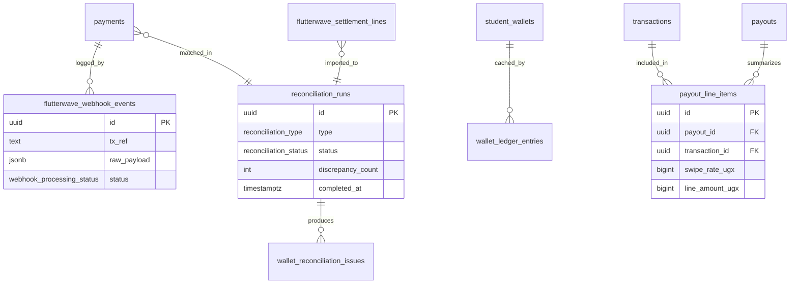
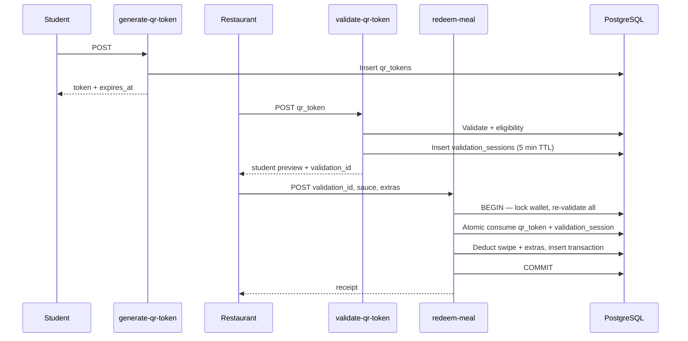

# LunchLink Technical Foundation v2

**Version:** 2.0  
**Status:** Production MVP foundation — documentation only (no application code)  
**Supersedes:** [Technical Foundation v1](./technical-foundation.md)  
**Authoritative business policy:** [Business Rules](./business-rules.md)  
**Inputs:** Business Rules · Technical Specification · Architecture Review v1

---

## Document Purpose

This document is the **authoritative technical blueprint** for LunchLink MVP implementation. It resolves all engineering blockers identified in the Architecture Review and aligns every technical decision with [Business Rules](./business-rules.md).

v2 changes from v1:

- New and amended database entities (reconciliation, payouts, fraud, settings)
- Auth helper functions relocated to `public` schema
- Complete RLS coverage on all tables
- Financial reconciliation architecture
- Payout engine with canonical rate precedence
- Expanded Edge Function catalog (cron, admin, reconciliation)
- Plan stacking semantics (additive; no balance overwrite)
- QR validation session binding
- Wallet idempotency and reconciliation

---

## Blocker Resolution Matrix

| # | Architecture Review Blocker | Resolution in v2 |
| - | --------------------------- | ---------------- |
| 1 | Publish canonical Business Rules | ✅ [business-rules.md](./business-rules.md) is authoritative; this doc references it |
| 2 | Platform commission / revenue model | ✅ §8 Financial Architecture — revenue = plan sales; liability = swipes × rate; no extras commission |
| 3 | Meal plan stacking behavior | ✅ §6 Wallet — additive credits; `latest_plan_purchase_id` for display only |
| 4 | Extras revenue allocation | ✅ Excluded from Swipe payout; 100% restaurant; tracked in `transaction_extras` |
| 5 | Semester rollover procedure | ✅ §11 Semester Rollover + `rollover-semester-wallets` Edge Function spec |
| 6 | Payout rate precedence | ✅ §9 Payout Architecture — restaurant → tier → university default |
| 7 | Plan upgrade/renew MVP scope | ✅ In MVP as **purchase additional plan** (stacking); no proration |
| 8 | Flutterwave production readiness | ✅ §10 checklist (operational; not code) |
| 9 | Auth helper schema | ✅ Functions in `public` schema: `current_user_role()`, etc. |
| 10 | Payment reconciliation architecture | ✅ §10 Financial Reconciliation — tables, jobs, admin flows |

---

## Table of Contents

1. [System Context](#1-system-context)
2. [Complete ER Diagram](#2-complete-er-diagram)
3. [Database Schema](#3-database-schema)
4. [Supabase Table Definitions](#4-supabase-table-definitions)
5. [Database Functions](#5-database-functions)
6. [Row Level Security](#6-row-level-security)
7. [Authentication Architecture](#7-authentication-architecture)
8. [Wallet Architecture](#8-wallet-architecture)
9. [Payout Architecture](#9-payout-architecture)
10. [Financial Reconciliation Architecture](#10-financial-reconciliation-architecture)
11. [QR Redemption Architecture](#11-qr-redemption-architecture)
12. [Flutterwave Integration](#12-flutterwave-integration)
13. [Edge Functions Catalog](#13-edge-functions-catalog)
14. [API Design](#14-api-design)
15. [Development Milestones](#15-development-milestones)

---

## 1. System Context

### 1.1 Policy → Technical Mapping

| Business Rule | Technical Enforcement |
| ------------- | --------------------- |
| 1 Swipe = 1 Standard Meal | `redeem-meal` deducts exactly `-1` swipe via `apply_wallet_delta` |
| Price opacity for students | RLS denies `restaurant_sauce_pricing`; Edge Functions strip internal costs |
| Plan stacking | Payment webhook **adds** to balances; never resets |
| Dining Plus → Dining Cash | Deduction order in `redeem-meal` transaction |
| 2 swipes/day, 3h cooldown | `check_redemption_eligibility()` inside redeem transaction |
| Swipe rate precedence | `resolve_swipe_rate(restaurant_id, semester_id)` SQL function |
| Refunds → Dining Cash | `admin/issue-refund` credits `dining_cash` only |
| University isolation | `university_id` on entities + RLS + Edge Function checks |
| Extras 100% restaurant | Not in `payouts`; optional `extras_settlement` report only |
| Verified gate | `photo_status = approved` AND `account_status = active` |

### 1.2 Terminology (Technical)

| Business Term | Storage |
| ------------- | ------- |
| Swipe Wallet | `student_wallets.swipe_balance` |
| Dining Plus | `student_wallets.dining_plus_balance_ugx` |
| Dining Cash | `student_wallets.dining_cash_balance_ugx` |
| LunchCredits (UI) | `dining_plus_balance_ugx + dining_cash_balance_ugx` (computed) |
| Verified | `photo_status = approved` AND `account_status = active` |
| Registered | Account exists; not yet verified |

### 1.3 Timezone Authority

All calendar boundaries (daily swipe limit, payout periods, semester expiry) use **`Africa/Kampala`** stored in `university_settings.timezone` (default) or `platform_settings.default_timezone`.

---

## 2. Complete ER Diagram

### 2.1 Core Domain

```mermaid
erDiagram
    universities ||--o{ university_settings : configures
    universities ||--o{ semesters : has
    universities ||--o{ students : enrolls
    universities ||--o{ restaurants : partners
    universities ||--o{ meal_plans : offers
    universities ||--o{ restaurant_tiers : defines
    universities ||--o{ feature_flags : toggles
    universities ||--o{ daily_university_stats : aggregates

    auth_users ||--|| profiles : extends
    auth_users ||--o| students : "is"
    auth_users ||--o{ staff_accounts : employs

    students ||--|| student_wallets : owns
    students ||--o{ qr_tokens : generates
    students ||--o{ validation_sessions : binds
    students ||--o{ device_sessions : tracks
    students ||--o{ student_plan_purchases : buys
    students ||--o{ wallet_ledger_entries : logs
    students ||--o{ fraud_alerts : triggers

    semesters ||--o{ student_wallets : scopes
    semesters ||--o{ payout_rate_configs : configures
    semesters ||--o{ payouts : periods

    meal_plans ||--o{ student_plan_purchases : fulfilled_by
    student_plan_purchases ||--o| payments : paid_via

    restaurants ||--o{ restaurant_locations : located_at
    restaurants ||--o{ restaurant_applications : originates
    restaurants ||--o{ restaurant_payout_accounts : paid_to
    restaurants ||--o{ staff_accounts : staffs
    restaurants ||--o{ sauces : catalogs
    restaurants ||--o{ extras : sells
    restaurants ||--o{ daily_menus : publishes
    restaurants ||--o{ payout_line_items : itemized_in
    restaurants ||--o{ daily_restaurant_stats : aggregates
    restaurants }o--|| restaurant_tiers : tiered

    sauces ||--o{ restaurant_sauce_pricing : internal_cost
    extras ||--o{ extra_price_history : tracks

    payments ||--o{ flutterwave_webhook_events : receives
    payments ||--o{ wallet_ledger_entries : credits

    transactions ||--o{ transaction_extras : includes
    transactions ||--o{ payout_line_items : settles
    transactions ||--o{ validation_sessions : completes

    payouts ||--o{ payout_line_items : contains

    reconciliation_runs ||--o{ wallet_reconciliation_issues : finds
    reconciliation_runs ||--o{ flutterwave_settlement_lines : matches

    platform_settings ||--|| singleton : global
```



### 2.2 Financial & Reconciliation Sub-Diagram



### 2.3 Redemption Flow (with Validation Session)



---

## 3. Database Schema

### 3.1 Design Principles (v2 Additions)

| Principle | Implementation |
| --------- | -------------- |
| Business Rules authority | Schema implements [business-rules.md](./business-rules.md); no conflicting semantics |
| Plan stacking | Purchases ADD to balances; `latest_plan_purchase_id` is display metadata only |
| Idempotent payments | Unique `(reference_type, reference_id, wallet_type)` on ledger; unique `flutterwave_tx_ref` |
| Idempotent redemption | `validation_sessions` single-use; atomic `qr_tokens` consumption |
| Rate precedence | Single SQL function `resolve_swipe_rate()` |
| Reconciliation | Nightly wallet drift + payment settlement jobs with issue tracking |
| Auth helpers in public | No custom objects in Supabase `auth` schema |
| RLS on every table | Including v1 gaps: `student_plan_purchases`, `refunds`, `included_foods`, etc. |
| Role immutability | `profiles.role` not client-writable |
| Append-only logs | `wallet_ledger_entries`, `audit_events`, `flutterwave_webhook_events` |

### 3.2 Enum Types

```sql
-- 001_enums.sql (amended v2)

CREATE TYPE user_role AS ENUM (
  'student', 'restaurant_staff', 'restaurant_manager', 'admin', 'university_admin'
);

CREATE TYPE user_status AS ENUM ('active', 'suspended', 'pending');
CREATE TYPE photo_status AS ENUM ('pending', 'approved', 'rejected');
CREATE TYPE student_account_status AS ENUM (
  'registered', 'pending_verification', 'active', 'suspended'
);
CREATE TYPE wallet_status AS ENUM ('active', 'frozen', 'closed');
CREATE TYPE restaurant_status AS ENUM ('pending', 'active', 'inactive', 'suspended');
CREATE TYPE restaurant_application_status AS ENUM (
  'submitted', 'under_review', 'approved', 'rejected'
);
CREATE TYPE wallet_type AS ENUM ('swipe', 'dining_plus', 'dining_cash');
CREATE TYPE ledger_reason AS ENUM (
  'plan_purchase', 'credit_top_up', 'meal_redemption', 'extra_purchase',
  'refund', 'semester_expiry', 'admin_adjustment', 'fraud_reversal'
);
CREATE TYPE transaction_type AS ENUM (
  'meal_redemption', 'extra_only', 'plan_purchase', 'credit_top_up', 'refund', 'void'
);
CREATE TYPE payment_type AS ENUM ('meal_plan', 'dining_cash_top_up');
CREATE TYPE payment_status AS ENUM (
  'pending', 'processing', 'success', 'failed', 'expired', 'refunded'
);
CREATE TYPE payment_provider AS ENUM ('mtn_momo', 'airtel_money');
CREATE TYPE payout_status AS ENUM ('draft', 'pending_approval', 'approved', 'paid', 'cancelled');
CREATE TYPE reconciliation_type AS ENUM (
  'wallet_ledger', 'flutterwave_payments', 'flutterwave_settlement', 'payout_audit'
);
CREATE TYPE reconciliation_status AS ENUM (
  'running', 'passed', 'failed', 'resolved'
);
CREATE TYPE webhook_processing_status AS ENUM (
  'received', 'processed', 'ignored_duplicate', 'failed', 'manual_review'
);
CREATE TYPE fraud_alert_status AS ENUM ('open', 'investigating', 'resolved', 'dismissed');
CREATE TYPE validation_session_status AS ENUM ('active', 'consumed', 'expired');
CREATE TYPE audit_action AS ENUM (
  'login', 'qr_generated', 'qr_validated', 'meal_redeemed', 'payment_initiated',
  'payment_completed', 'payment_failed', 'payment_expired', 'refund_issued',
  'wallet_credited', 'wallet_debited', 'photo_approved', 'photo_rejected',
  'semester_rolled', 'payout_generated', 'payout_approved', 'admin_action',
  'reconciliation_run', 'fraud_alert_created'
);
```

### 3.3 Entity Catalog (v2)

| Table | Purpose | New in v2 |
| ----- | ------- | --------- |
| `platform_settings` | Global config singleton | ✅ |
| `university_settings` | Per-university limits, default swipe rate, timezone | ✅ |
| `university_settings` | Top-up min/max, cooldown override | ✅ |
| `restaurant_applications` | Public restaurant signup pipeline | ✅ |
| `restaurant_payout_accounts` | Disbursement destination (encrypted) | ✅ |
| `flutterwave_webhook_events` | Immutable webhook log + replay | ✅ |
| `flutterwave_settlement_lines` | Imported settlement rows | ✅ |
| `reconciliation_runs` | Reconciliation job header | ✅ |
| `wallet_reconciliation_issues` | Drift / mismatch records | ✅ |
| `payout_line_items` | Transaction-level payout audit | ✅ |
| `validation_sessions` | Bind validate → redeem (5 min) | ✅ |
| `device_sessions` | Device fingerprint correlation | ✅ |
| `fraud_alerts` | Fraud monitoring queue | ✅ |
| `feature_flags` | Per-university feature toggles | ✅ |
| `extra_price_history` | Extras price audit trail | ✅ |
| `daily_university_stats` | Pre-aggregated reporting | ✅ |
| `daily_restaurant_stats` | Pre-aggregated reporting | ✅ |
| `wallet_adjustments` | Admin adjustments with dual approval | ✅ |
| *v1 tables* | Core domain | amended |

### 3.4 Amended v1 Tables

**`student_wallets` (v2 changes):**

| Column | Change |
| ------ | ------ |
| `active_meal_plan_id` | **Renamed** → `latest_plan_purchase_id` (FK → `student_plan_purchases.id`) — display only |
| `wallet_status` | **Added** — `active`, `frozen`, `closed` |
| `version` | **Added** — optimistic concurrency counter |

**`students` (v2 changes):**

| Column | Change |
| ------ | ------ |
| `verification_tier` | **Added** — `registered`, `verified`, `sponsored` (future) |
| `sponsored` | Reserved; default false |

**`payments` (v2 changes):**

| Column | Change |
| ------ | ------ |
| `expires_at` | **Added** — pending payment TTL (default +15 min) |
| `idempotency_key` | **Added** — client-initiated dedup |
| `reconciliation_run_id` | **Added** — last matched run |

**`payouts` (v2 changes):**

| Column | Change |
| ------ | ------ |
| `approved_by` | **Added** |
| `approved_at` | **Added** |
| `locked_at` | **Added** — period lock on approval |
| `status` | Uses `pending_approval`, `approved` per Business Rules §8.7 |

**`transactions` (v2 changes):**

| Column | Change |
| ------ | ------ |
| `receipt_number` | **Added** — unique, human-readable |
| `university_id` | **Added** — denormalized for reporting |
| `excluded_from_payout` | **Added** — fraud void flag |
| `voided_at` | **Added** — admin reversal |

---

## 4. Supabase Table Definitions

Migrations `001`–`020`. Apply in order.

### 4.1 Migration 002 — Platform & University Settings

```sql
CREATE TABLE platform_settings (
  id                      UUID PRIMARY KEY DEFAULT gen_random_uuid(),
  singleton               BOOLEAN NOT NULL DEFAULT true UNIQUE CHECK (singleton = true),
  default_timezone        TEXT NOT NULL DEFAULT 'Africa/Kampala',
  pending_payment_ttl_min INT NOT NULL DEFAULT 15,
  qr_token_ttl_seconds    INT NOT NULL DEFAULT 120,
  validation_session_ttl_seconds INT NOT NULL DEFAULT 300,
  global_redemption_cooldown_hours INT NOT NULL DEFAULT 3,
  global_daily_swipe_limit INT NOT NULL DEFAULT 2,
  wallet_reconciliation_enabled BOOLEAN NOT NULL DEFAULT true,
  updated_at              TIMESTAMPTZ NOT NULL DEFAULT now()
);

CREATE TABLE university_settings (
  id                      UUID PRIMARY KEY DEFAULT gen_random_uuid(),
  university_id           UUID NOT NULL UNIQUE REFERENCES universities(id),
  timezone                TEXT NOT NULL DEFAULT 'Africa/Kampala',
  default_swipe_rate_ugx  BIGINT NOT NULL CHECK (default_swipe_rate_ugx > 0),
  dining_cash_topup_min_ugx BIGINT NOT NULL DEFAULT 500000,
  dining_cash_topup_max_ugx BIGINT NOT NULL DEFAULT 50000000,
  redemption_cooldown_hours INT,
  daily_swipe_limit       INT,
  low_swipe_threshold     INT NOT NULL DEFAULT 5,
  low_dining_plus_threshold_ugx BIGINT NOT NULL DEFAULT 1000000,
  settings                JSONB NOT NULL DEFAULT '{}',
  updated_at              TIMESTAMPTZ NOT NULL DEFAULT now()
);
```

### 4.2 Migration 004 — Wallets (v2)

```sql
CREATE TABLE student_wallets (
  id                        UUID PRIMARY KEY DEFAULT gen_random_uuid(),
  student_id                UUID NOT NULL UNIQUE REFERENCES students(id) ON DELETE CASCADE,
  semester_id               UUID NOT NULL REFERENCES semesters(id),
  swipe_balance             INT NOT NULL DEFAULT 0 CHECK (swipe_balance >= 0),
  dining_plus_balance_ugx   BIGINT NOT NULL DEFAULT 0 CHECK (dining_plus_balance_ugx >= 0),
  dining_cash_balance_ugx BIGINT NOT NULL DEFAULT 0 CHECK (dining_cash_balance_ugx >= 0),
  latest_plan_purchase_id   UUID,
  semester_expires_at       TIMESTAMPTZ NOT NULL,
  wallet_status             wallet_status NOT NULL DEFAULT 'active',
  version                   INT NOT NULL DEFAULT 0,
  created_at                TIMESTAMPTZ NOT NULL DEFAULT now(),
  updated_at                TIMESTAMPTZ NOT NULL DEFAULT now()
);

CREATE TABLE wallet_ledger_entries (
  id              UUID PRIMARY KEY DEFAULT gen_random_uuid(),
  student_id      UUID NOT NULL REFERENCES students(id),
  wallet_type     wallet_type NOT NULL,
  delta           BIGINT NOT NULL,
  balance_after   BIGINT NOT NULL,
  reason          ledger_reason NOT NULL,
  reference_type  TEXT NOT NULL,
  reference_id    UUID NOT NULL,
  request_id      UUID,
  metadata        JSONB NOT NULL DEFAULT '{}',
  created_at      TIMESTAMPTZ NOT NULL DEFAULT now(),
  UNIQUE (reference_type, reference_id, wallet_type)
);

CREATE TABLE wallet_adjustments (
  id                UUID PRIMARY KEY DEFAULT gen_random_uuid(),
  student_id        UUID NOT NULL REFERENCES students(id),
  wallet_type       wallet_type NOT NULL,
  delta             BIGINT NOT NULL,
  reason            TEXT NOT NULL,
  requested_by      UUID NOT NULL REFERENCES auth.users(id),
  approved_by       UUID REFERENCES auth.users(id),
  ledger_entry_id   UUID REFERENCES wallet_ledger_entries(id),
  status            TEXT NOT NULL DEFAULT 'pending' CHECK (status IN ('pending','approved','rejected')),
  created_at        TIMESTAMPTZ NOT NULL DEFAULT now()
);
```

### 4.3 Migration 005 — Plan Purchases (Stacking)

```sql
CREATE TABLE student_plan_purchases (
  id                      UUID PRIMARY KEY DEFAULT gen_random_uuid(),
  student_id              UUID NOT NULL REFERENCES students(id),
  meal_plan_id            UUID NOT NULL REFERENCES meal_plans(id),
  payment_id              UUID NOT NULL UNIQUE,
  swipes_granted          INT NOT NULL,
  dining_plus_granted_ugx BIGINT NOT NULL,
  plan_price_ugx          BIGINT NOT NULL,
  purchased_at            TIMESTAMPTZ NOT NULL DEFAULT now(),
  created_at              TIMESTAMPTZ NOT NULL DEFAULT now()
);

-- Stacking: each purchase is immutable record; wallet balances are sum of all credits minus debits
ALTER TABLE student_wallets
  ADD CONSTRAINT fk_latest_plan_purchase
  FOREIGN KEY (latest_plan_purchase_id) REFERENCES student_plan_purchases(id);
```

### 4.4 Migration 006b — Restaurant Applications & Payout Accounts

```sql
CREATE TABLE restaurant_applications (
  id              UUID PRIMARY KEY DEFAULT gen_random_uuid(),
  university_id   UUID NOT NULL REFERENCES universities(id),
  business_name   TEXT NOT NULL,
  contact_name    TEXT NOT NULL,
  contact_email   TEXT NOT NULL,
  contact_phone   TEXT NOT NULL,
  address         TEXT NOT NULL,
  description     TEXT,
  status          restaurant_application_status NOT NULL DEFAULT 'submitted',
  reviewed_by     UUID REFERENCES auth.users(id),
  restaurant_id   UUID REFERENCES restaurants(id),
  notes           TEXT,
  created_at      TIMESTAMPTZ NOT NULL DEFAULT now(),
  updated_at      TIMESTAMPTZ NOT NULL DEFAULT now()
);

CREATE TABLE restaurant_payout_accounts (
  id              UUID PRIMARY KEY DEFAULT gen_random_uuid(),
  restaurant_id   UUID NOT NULL UNIQUE REFERENCES restaurants(id),
  account_type    TEXT NOT NULL CHECK (account_type IN ('mtn_momo','airtel_money','bank')),
  account_name    TEXT NOT NULL,
  account_number  TEXT NOT NULL,
  is_verified     BOOLEAN NOT NULL DEFAULT false,
  created_at      TIMESTAMPTZ NOT NULL DEFAULT now(),
  updated_at      TIMESTAMPTZ NOT NULL DEFAULT now()
);
```

### 4.5 Migration 007b — Validation Sessions & Device Tracking

```sql
CREATE TABLE validation_sessions (
  id              UUID PRIMARY KEY DEFAULT gen_random_uuid(),
  qr_token_id     UUID NOT NULL REFERENCES qr_tokens(id),
  student_id      UUID NOT NULL REFERENCES students(id),
  restaurant_id   UUID NOT NULL REFERENCES restaurants(id),
  staff_id        UUID NOT NULL REFERENCES staff_accounts(id),
  status          validation_session_status NOT NULL DEFAULT 'active',
  expires_at      TIMESTAMPTZ NOT NULL,
  consumed_at     TIMESTAMPTZ,
  transaction_id  UUID REFERENCES transactions(id),
  request_id      UUID,
  created_at      TIMESTAMPTZ NOT NULL DEFAULT now()
);

CREATE INDEX idx_validation_sessions_active
  ON validation_sessions (id, status) WHERE status = 'active';

CREATE TABLE device_sessions (
  id                  UUID PRIMARY KEY DEFAULT gen_random_uuid(),
  student_id          UUID NOT NULL REFERENCES students(id),
  device_fingerprint  TEXT NOT NULL,
  last_seen_at        TIMESTAMPTZ NOT NULL DEFAULT now(),
  qr_generation_count INT NOT NULL DEFAULT 0,
  created_at          TIMESTAMPTZ NOT NULL DEFAULT now(),
  UNIQUE (student_id, device_fingerprint)
);
```

### 4.6 Migration 008b — Financial Reconciliation

```sql
CREATE TABLE flutterwave_webhook_events (
  id              UUID PRIMARY KEY DEFAULT gen_random_uuid(),
  tx_ref          TEXT NOT NULL,
  flutterwave_id  TEXT,
  event_type      TEXT NOT NULL,
  raw_payload     JSONB NOT NULL,
  signature_valid BOOLEAN NOT NULL,
  processing_status webhook_processing_status NOT NULL DEFAULT 'received',
  payment_id      UUID REFERENCES payments(id),
  error_message   TEXT,
  request_id      UUID,
  received_at     TIMESTAMPTZ NOT NULL DEFAULT now(),
  processed_at    TIMESTAMPTZ
);

CREATE INDEX idx_fw_webhook_tx_ref ON flutterwave_webhook_events (tx_ref);

CREATE TABLE flutterwave_settlement_lines (
  id                    UUID PRIMARY KEY DEFAULT gen_random_uuid(),
  reconciliation_run_id UUID REFERENCES reconciliation_runs(id),
  settlement_date       DATE NOT NULL,
  tx_ref                TEXT,
  flutterwave_id        TEXT,
  amount_ugx            BIGINT NOT NULL,
  currency              TEXT NOT NULL DEFAULT 'UGX',
  matched_payment_id    UUID REFERENCES payments(id),
  match_status          TEXT NOT NULL DEFAULT 'unmatched',
  raw_data              JSONB NOT NULL DEFAULT '{}',
  created_at            TIMESTAMPTZ NOT NULL DEFAULT now()
);

CREATE TABLE reconciliation_runs (
  id                  UUID PRIMARY KEY DEFAULT gen_random_uuid(),
  run_type            reconciliation_type NOT NULL,
  status              reconciliation_status NOT NULL DEFAULT 'running',
  university_id       UUID REFERENCES universities(id),
  period_start        TIMESTAMPTZ,
  period_end          TIMESTAMPTZ,
  records_checked     INT NOT NULL DEFAULT 0,
  discrepancy_count   INT NOT NULL DEFAULT 0,
  summary             JSONB NOT NULL DEFAULT '{}',
  started_by          UUID REFERENCES auth.users(id),
  started_at          TIMESTAMPTZ NOT NULL DEFAULT now(),
  completed_at        TIMESTAMPTZ
);

CREATE TABLE wallet_reconciliation_issues (
  id                    UUID PRIMARY KEY DEFAULT gen_random_uuid(),
  reconciliation_run_id UUID NOT NULL REFERENCES reconciliation_runs(id),
  student_id            UUID REFERENCES students(id),
  payment_id            UUID REFERENCES payments(id),
  issue_type            TEXT NOT NULL,
  expected_value        BIGINT,
  actual_value          BIGINT,
  details               JSONB NOT NULL DEFAULT '{}',
  resolved              BOOLEAN NOT NULL DEFAULT false,
  resolved_by           UUID REFERENCES auth.users(id),
  resolved_at           TIMESTAMPTZ,
  created_at            TIMESTAMPTZ NOT NULL DEFAULT now()
);
```

### 4.7 Migration 008c — Payout Line Items

```sql
CREATE TABLE payout_line_items (
  id                UUID PRIMARY KEY DEFAULT gen_random_uuid(),
  payout_id         UUID NOT NULL REFERENCES payouts(id) ON DELETE CASCADE,
  transaction_id    UUID NOT NULL UNIQUE REFERENCES transactions(id),
  restaurant_id     UUID NOT NULL REFERENCES restaurants(id),
  student_id        UUID NOT NULL REFERENCES students(id),
  swipe_rate_ugx    BIGINT NOT NULL,
  line_amount_ugx   BIGINT NOT NULL DEFAULT 0,
  rate_source       TEXT NOT NULL CHECK (rate_source IN (
    'restaurant_specific', 'tier_default', 'university_default'
  )),
  created_at        TIMESTAMPTZ NOT NULL DEFAULT now()
);

-- payouts table amendments
ALTER TABLE payouts
  ADD COLUMN approved_by UUID REFERENCES auth.users(id),
  ADD COLUMN approved_at TIMESTAMPTZ,
  ADD COLUMN locked_at TIMESTAMPTZ,
  ADD COLUMN rate_snapshot JSONB NOT NULL DEFAULT '{}';
```

### 4.8 Migration 008d — Fraud, Feature Flags, Stats, Price History

```sql
CREATE TABLE fraud_alerts (
  id              UUID PRIMARY KEY DEFAULT gen_random_uuid(),
  student_id      UUID REFERENCES students(id),
  restaurant_id   UUID REFERENCES restaurants(id),
  alert_type      TEXT NOT NULL,
  severity        TEXT NOT NULL DEFAULT 'medium',
  status          fraud_alert_status NOT NULL DEFAULT 'open',
  details         JSONB NOT NULL DEFAULT '{}',
  assigned_to     UUID REFERENCES auth.users(id),
  resolved_at     TIMESTAMPTZ,
  created_at      TIMESTAMPTZ NOT NULL DEFAULT now()
);

CREATE TABLE feature_flags (
  id              UUID PRIMARY KEY DEFAULT gen_random_uuid(),
  university_id   UUID REFERENCES universities(id),
  feature_key     TEXT NOT NULL,
  enabled         BOOLEAN NOT NULL DEFAULT false,
  description     TEXT,
  UNIQUE (university_id, feature_key)
);

CREATE TABLE extra_price_history (
  id              UUID PRIMARY KEY DEFAULT gen_random_uuid(),
  extra_id        UUID NOT NULL REFERENCES extras(id),
  price_ugx       BIGINT NOT NULL,
  effective_from  TIMESTAMPTZ NOT NULL DEFAULT now(),
  changed_by      UUID REFERENCES auth.users(id),
  created_at      TIMESTAMPTZ NOT NULL DEFAULT now()
);

CREATE TABLE daily_university_stats (
  id                      UUID PRIMARY KEY DEFAULT gen_random_uuid(),
  university_id           UUID NOT NULL REFERENCES universities(id),
  stat_date               DATE NOT NULL,
  plan_collections_ugx    BIGINT NOT NULL DEFAULT 0,
  topup_collections_ugx   BIGINT NOT NULL DEFAULT 0,
  swipes_redeemed         INT NOT NULL DEFAULT 0,
  swipe_liability_ugx     BIGINT NOT NULL DEFAULT 0,
  extras_volume_ugx       BIGINT NOT NULL DEFAULT 0,
  new_students            INT NOT NULL DEFAULT 0,
  UNIQUE (university_id, stat_date)
);

CREATE TABLE daily_restaurant_stats (
  id                  UUID PRIMARY KEY DEFAULT gen_random_uuid(),
  restaurant_id       UUID NOT NULL REFERENCES restaurants(id),
  stat_date           DATE NOT NULL,
  swipes_redeemed     INT NOT NULL DEFAULT 0,
  extras_revenue_ugx  BIGINT NOT NULL DEFAULT 0,
  unique_students     INT NOT NULL DEFAULT 0,
  UNIQUE (restaurant_id, stat_date)
);
```

### 4.9 Migration 007 — Payments (v2 amendments)

```sql
ALTER TABLE payments
  ADD COLUMN expires_at TIMESTAMPTZ,
  ADD COLUMN idempotency_key TEXT UNIQUE,
  ADD COLUMN reconciliation_status TEXT NOT NULL DEFAULT 'unmatched';

-- Set expires_at on insert: now() + platform_settings.pending_payment_ttl_min
```

### 4.10 Migration 007 — Transactions (v2 amendments)

```sql
ALTER TABLE transactions
  ADD COLUMN receipt_number TEXT UNIQUE,
  ADD COLUMN university_id UUID NOT NULL REFERENCES universities(id),
  ADD COLUMN excluded_from_payout BOOLEAN NOT NULL DEFAULT false,
  ADD COLUMN voided_at TIMESTAMPTZ,
  ADD COLUMN request_id UUID;
```

### 4.11 Indexes (v2 additions)

| Index | Purpose |
| ----- | ------- |
| `idx_payments_status_expires` ON `payments(status, expires_at)` WHERE status = 'pending' | Expiry cron |
| `idx_transactions_payout` ON `transactions(restaurant_id, created_at)` WHERE type = 'meal_redemption' AND NOT excluded_from_payout | Payout calc |
| `idx_ledger_student_type` ON `wallet_ledger_entries(student_id, wallet_type, created_at DESC)` | Reconciliation |
| `idx_fraud_alerts_open` ON `fraud_alerts(status)` WHERE status IN ('open','investigating') | Admin queue |

---

## 5. Database Functions

All helpers live in **`public` schema** (Supabase-compatible).

### 5.1 JWT / Session Helpers

```sql
CREATE OR REPLACE FUNCTION public.current_user_role()
RETURNS user_role LANGUAGE sql STABLE SECURITY DEFINER SET search_path = public AS $$
  SELECT p.role FROM profiles p WHERE p.user_id = auth.uid();
$$;

CREATE OR REPLACE FUNCTION public.current_student_id()
RETURNS UUID LANGUAGE sql STABLE SECURITY DEFINER SET search_path = public AS $$
  SELECT s.id FROM students s WHERE s.user_id = auth.uid();
$$;

CREATE OR REPLACE FUNCTION public.current_university_id()
RETURNS UUID LANGUAGE sql STABLE SECURITY DEFINER SET search_path = public AS $$
  SELECT COALESCE(
    (SELECT s.university_id FROM students s WHERE s.user_id = auth.uid()),
    (SELECT p.university_id FROM profiles p WHERE p.user_id = auth.uid()),
    (SELECT r.university_id FROM staff_accounts sa
     JOIN restaurants r ON r.id = sa.restaurant_id
     WHERE sa.user_id = auth.uid() AND sa.is_active LIMIT 1)
  );
$$;

CREATE OR REPLACE FUNCTION public.current_restaurant_id()
RETURNS UUID LANGUAGE sql STABLE SECURITY DEFINER SET search_path = public AS $$
  SELECT sa.restaurant_id FROM staff_accounts sa
  WHERE sa.user_id = auth.uid() AND sa.is_active LIMIT 1;
$$;

CREATE OR REPLACE FUNCTION public.is_admin_or_university_admin()
RETURNS BOOLEAN LANGUAGE sql STABLE SECURITY DEFINER SET search_path = public AS $$
  SELECT current_user_role() IN ('admin', 'university_admin');
$$;
```

### 5.2 Swipe Rate Resolution (Business Rules §8.3)

```sql
CREATE OR REPLACE FUNCTION public.resolve_swipe_rate(
  p_restaurant_id UUID,
  p_semester_id UUID
)
RETURNS TABLE (rate_ugx BIGINT, rate_source TEXT)
LANGUAGE plpgsql STABLE SECURITY DEFINER SET search_path = public AS $$
DECLARE
  v_university_id UUID;
  v_tier_id UUID;
BEGIN
  SELECT r.university_id, r.tier_id INTO v_university_id, v_tier_id
  FROM restaurants r WHERE r.id = p_restaurant_id;

  -- 1. Restaurant-specific rate
  RETURN QUERY
  SELECT prc.payout_rate_ugx, 'restaurant_specific'::TEXT
  FROM payout_rate_configs prc
  WHERE prc.restaurant_id = p_restaurant_id AND prc.semester_id = p_semester_id
  LIMIT 1;
  IF FOUND THEN RETURN; END IF;

  -- 2. Tier default
  RETURN QUERY
  SELECT rt.default_payout_rate_ugx, 'tier_default'::TEXT
  FROM restaurant_tiers rt WHERE rt.id = v_tier_id;
  IF FOUND THEN RETURN; END IF;

  -- 3. University default
  RETURN QUERY
  SELECT us.default_swipe_rate_ugx, 'university_default'::TEXT
  FROM university_settings us WHERE us.university_id = v_university_id;
END;
$$;
```

### 5.3 Wallet Mutation (v2 — idempotent)

```sql
-- apply_wallet_delta: same as v1 but:
-- 1. Checks wallet_status = 'active'
-- 2. ON CONFLICT (reference_type, reference_id, wallet_type) DO NOTHING — returns existing entry
-- 3. Increments student_wallets.version
-- 4. REVOKE EXECUTE FROM authenticated, anon; GRANT TO service_role only
```

### 5.4 Redemption Eligibility (v2 — inside transaction)

```sql
-- check_redemption_eligibility(p_student_id):
-- Uses university_settings.redemption_cooldown_hours OR platform default
-- Uses university_settings.daily_swipe_limit OR platform default
-- Uses timezone from university_settings for daily boundary
-- Marked VOLATILE (not STABLE)
-- Checks wallet_status = 'active'
```

### 5.5 Receipt Number Generator

```sql
CREATE OR REPLACE FUNCTION public.generate_receipt_number(p_prefix TEXT)
RETURNS TEXT LANGUAGE plpgsql AS $$
BEGIN
  RETURN p_prefix || '-' || to_char(now() AT TIME ZONE 'Africa/Kampala', 'YYYYMMDD')
         || '-' || lpad(nextval('receipt_number_seq')::TEXT, 6, '0');
END;
$$;
```

### 5.6 Semester Expiry

```sql
-- expire_semester_balances(p_semester_id):
-- For each student_wallet where semester_id = p_semester_id:
--   apply_wallet_delta swipe: -swipe_balance (semester_expiry) if > 0
--   apply_wallet_delta dining_plus: -dining_plus_balance (semester_expiry) if > 0
--   dining_cash untouched
--   Notify students
```

---

## 6. Row Level Security

### 6.1 Global Rules

- RLS **enabled on every public table** (including all v2 tables)
- `apply_wallet_delta`, `resolve_swipe_rate` — **no EXECUTE** for `authenticated` / `anon`
- `profiles.role` — UPDATE blocked via policy: `WITH CHECK (role = (SELECT role FROM profiles WHERE user_id = auth.uid()))`
- `wallet_ledger_entries`, `flutterwave_webhook_events`, `audit_events` — **INSERT via service role only**; SELECT restricted
- Admin access: `current_user_role() = 'admin'` OR (`university_admin` AND matching `university_id`)

### 6.2 Complete Policy Matrix

| Table | Student | Staff | Manager | Univ Admin | Admin |
| ----- | ------- | ----- | ------- | ---------- | ----- |
| `universities` | SELECT active | SELECT | SELECT | SELECT own | ALL |
| `university_settings` | — | — | — | SELECT own | ALL |
| `students` | SELECT/UPDATE own | — | — | SELECT uni | ALL |
| `student_wallets` | SELECT own | — | — | SELECT uni | ALL |
| `wallet_ledger_entries` | SELECT own | — | — | SELECT uni | ALL |
| `wallet_adjustments` | — | — | — | — | ALL |
| `meal_plans` | SELECT campus active | — | — | ALL uni | ALL |
| `student_plan_purchases` | SELECT own | — | — | SELECT uni | ALL |
| `restaurants` | SELECT campus active | SELECT own | SELECT/UPDATE own | ALL uni | ALL |
| `restaurant_sauce_pricing` | **DENY** | **DENY** | SELECT/WRITE own | SELECT uni | ALL |
| `extras` | SELECT campus | SELECT own | ALL own | SELECT uni | ALL |
| `extra_price_history` | **DENY** | — | SELECT own | SELECT uni | ALL |
| `daily_menus` | SELECT campus | SELECT own | ALL own | SELECT uni | ALL |
| `included_foods` | SELECT campus | SELECT own | ALL own | SELECT uni | ALL |
| `sauces` | SELECT campus | SELECT own | ALL own | SELECT uni | ALL |
| `transactions` | SELECT own | SELECT own rest. | SELECT own | SELECT uni | ALL |
| `payments` | SELECT own | — | — | SELECT uni | ALL |
| `qr_tokens` | **DENY** (Edge Fn only) | — | — | — | SELECT |
| `validation_sessions` | **DENY** | — | — | — | SELECT |
| `payouts` | **DENY** | — | SELECT own | SELECT uni | ALL |
| `payout_line_items` | **DENY** | — | SELECT own | SELECT uni | ALL |
| `flutterwave_webhook_events` | **DENY** | — | — | — | SELECT |
| `reconciliation_runs` | **DENY** | — | — | SELECT uni | ALL |
| `wallet_reconciliation_issues` | **DENY** | — | — | — | ALL |
| `fraud_alerts` | — | — | — | SELECT uni | ALL |
| `restaurant_applications` | INSERT (public) | — | — | SELECT uni | ALL |
| `restaurant_payout_accounts` | **DENY** | — | SELECT own | SELECT uni | ALL |
| `device_sessions` | SELECT own | — | — | — | ALL |
| `notifications` | SELECT/UPDATE own | SELECT own | SELECT own | — | ALL |
| `audit_events` | — | — | — | SELECT uni | SELECT |
| `photo_approvals` | — | — | — | SELECT uni | ALL |
| `staff_accounts` | — | SELECT own | ALL own rest. | SELECT uni | ALL |
| `feature_flags` | SELECT enabled | SELECT | SELECT | ALL uni | ALL |
| `daily_*_stats` | **DENY** | — | SELECT own | SELECT uni | ALL |
| `platform_settings` | — | — | — | — | SELECT |
| `refunds` | SELECT own | — | — | SELECT uni | ALL |

### 6.3 Storage RLS (unchanged from v1)

- `student-photos`: student upload own folder; admin read; restaurant via signed URL from Edge Function only

### 6.4 RLS Implementation Notes

Replace all v1 references to `auth.user_role()` with `public.current_user_role()`.

**University admin scoping:**

```sql
-- Example: students visible to university_admin
CREATE POLICY students_university_admin ON students FOR SELECT USING (
  current_user_role() = 'university_admin'
  AND university_id = (SELECT university_id FROM profiles WHERE user_id = auth.uid())
);
```

---

## 7. Authentication Architecture

### 7.1 Custom Access Token Hook (Postgres)

Claims injected at token issuance:

```json
{
  "role": "student",
  "university_id": "uuid",
  "student_id": "uuid",
  "restaurant_id": null,
  "photo_status": "approved",
  "account_status": "active",
  "wallet_status": "active",
  "verification_tier": "verified"
}
```

### 7.2 Role Model (v2)

| Role | Scope |
| ---- | ----- |
| `student` | Own data; campus resources |
| `restaurant_staff` | Own restaurant; scan/redeem |
| `restaurant_manager` | Own restaurant; catalog, staff, payouts view |
| `university_admin` | Single `profiles.university_id`; students, reports, photo approval |
| `admin` | Platform-wide |

### 7.3 Access Gates (Business Rules aligned)

| Gate | Blocks |
| ---- | ------ |
| `verification_tier != verified` | QR, payments, redemption |
| `wallet_status = frozen` | All wallet mutations |
| `account_status = suspended` | All student actions |
| `photo_status != approved` | Same as unverified for MVP |

### 7.4 Security (v2)

- Admin MFA required before production
- `profiles.role` immutable by client
- Session invalidation on suspension via Auth Admin API
- Login events → `audit_events` via Auth hook
- `X-Request-ID` on all Edge Function requests → stored in audit/ledger metadata

---

## 8. Wallet Architecture

### 8.1 Three-Wallet Model

Unchanged from Business Rules §4. Implemented on single `student_wallets` row per student.

### 8.2 Plan Stacking (Business Rules §5.2)

**On successful meal plan payment:**

```
swipe_balance            += plan.swipe_allocation
dining_plus_balance_ugx  += plan.dining_plus_allocation_ugx
latest_plan_purchase_id   = new student_plan_purchases.id  -- display only
```

Balances are **never reset** on new purchase. Multiple `student_plan_purchases` rows accumulate.

**"Upgrade" / "Renew" in UI** = purchase another plan (additive).

### 8.3 Extras Deduction Priority

```
dining_plus_used = MIN(dining_plus_balance, total_extras_cost)
dining_cash_used = total_extras_cost - dining_plus_used
```

Recorded per line in `transaction_extras.dining_plus_used_ugx` / `dining_cash_used_ugx`.

### 8.4 Idempotency

| Event | Key |
| ----- | --- |
| Plan credit | `(reference_type='payment', reference_id=payment.id, wallet_type)` |
| Top-up credit | Same |
| Redemption debit | `(reference_type='transaction', reference_id=transaction.id, wallet_type)` |
| Refund | `(reference_type='refund', reference_id=refund.id, wallet_type)` |

Duplicate webhook → ledger unique constraint → no double credit.

### 8.5 Wallet Reconciliation (nightly)

Job `reconcile-wallets` compares for each student:

```
SUM(ledger.delta WHERE wallet_type = X)  ==  cached balance for X
```

Drift → `wallet_reconciliation_issues` → blocks payout approval until resolved.

### 8.6 Top-Up Bounds

From `university_settings`:

- Default min: 5,000 UGX
- Default max: 500,000 UGX per transaction

Enforced in `initiate-payment` Edge Function.

---

## 9. Payout Architecture

### 9.1 Formula (Business Rules §8.2)

```
Restaurant Swipe Payout = COUNT(eligible redemptions in period) × Applicable Swipe Rate
```

**Excluded from payout:**

- Extras revenue (100% restaurant; not part of Swipe payout batch)
- Transactions with `excluded_from_payout = true` (fraud void)
- Voided transactions (`voided_at IS NOT NULL`)

### 9.2 Rate Precedence (Business Rules §8.3)

Implemented by `resolve_swipe_rate(restaurant_id, semester_id)`:

1. `payout_rate_configs` for restaurant + semester
2. `restaurant_tiers.default_payout_rate_ugx`
3. `university_settings.default_swipe_rate_ugx`

Rate changes are **forward-only** from `effective_from`. Closed payout periods are immutable.

### 9.3 Weekly Payout Generation

**Edge Function:** `calculate-payouts` (cron: Monday 06:00 Africa/Kampala)

| Step | Action |
| ---- | ------ |
| 1 | For each active restaurant, period = previous Mon–Sun |
| 2 | Select `transactions` WHERE `type = meal_redemption` AND NOT excluded AND voided_at IS NULL |
| 3 | For each transaction, call `resolve_swipe_rate()` — snapshot rate on `payout_line_items` |
| 4 | Sum line amounts → `payouts.amount_due_ugx` |
| 5 | Status = `draft` |
| 6 | Write `audit_events` (`payout_generated`) |

### 9.4 Payout Approval Workflow (Business Rules §8.7)

```
draft → pending_approval → approved → paid
         ↑ Finance review    ↑ locked_at set
```

| Status | Meaning |
| ------ | ------- |
| `draft` | System-generated; editable |
| `pending_approval` | Submitted to Finance |
| `approved` | Locked; `locked_at` set; no transaction changes |
| `paid` | Disbursement recorded; `paid_at` set |

**Disbursement** (actual MoMo/bank transfer) is Phase 2; MVP records `paid` status manually after offline transfer.

### 9.5 Payout Line Items

Each `meal_redemption` transaction produces one `payout_line_item`:

| Field | Value |
| ----- | ----- |
| `transaction_id` | FK — unique (one line per redemption) |
| `swipe_rate_ugx` | Rate at generation time |
| `line_amount_ugx` | = swipe_rate_ugx (1 swipe per redemption) |
| `rate_source` | `restaurant_specific` / `tier_default` / `university_default` |

Enables restaurant dispute resolution at transaction level.

### 9.6 Payout Exclusions & Adjustments

- **Fraud void:** Admin sets `transactions.excluded_from_payout = true`; may trigger `void-redemption` with ledger reversal
- **Payout adjustment:** Negative adjustment in next period via `payouts.rate_snapshot` notes — no retroactive edit to locked periods

### 9.7 Restaurant Payout Account

`restaurant_payout_accounts` stores disbursement destination. Manager submits; Admin verifies (`is_verified = true`) before first payout.

---

## 10. Financial Reconciliation Architecture

### 10.1 Reconciliation Domains

| Domain | Job | Frequency |
| ------ | --- | --------- |
| Wallet ledger vs balances | `reconcile-wallets` | Nightly |
| Flutterwave webhooks vs payments | `reconcile-payments` | Hourly |
| Flutterwave settlement import | `process-flutterwave-settlement` | Daily |
| Payout vs transactions | `reconcile-payouts` | On payout approval |

### 10.2 Payment Lifecycle (v2)

```
initiate-payment
  → INSERT payments (status=pending, expires_at=now+15min)
  → Flutterwave charge

Webhook OR verify-payment-status
  → INSERT flutterwave_webhook_events (always, raw payload)
  → IF signature valid AND amount matches AND status=success:
       UPDATE payments (status=success) — idempotent
       Credit wallet via apply_wallet_delta — idempotent
  → IF pending AND now > expires_at:
       expire-pending-payments cron → status=expired
```

### 10.3 Webhook Processing Rules

| Rule | Detail |
| ---- | ------ |
| Always log | Raw payload → `flutterwave_webhook_events` before processing |
| Signature | Verify `verif-hash`; set `signature_valid` |
| Idempotency | If payment already `success`, mark webhook `ignored_duplicate` |
| Amount match | Webhook amount must equal `payments.amount_ugx` |
| Manual resolve | Admin `reconcile-payment` after Flutterwave verify API confirms |

### 10.4 Wallet Reconciliation

Nightly `reconcile-wallets`:

1. Create `reconciliation_runs` (type=`wallet_ledger`)
2. For each `student_wallets` row, compare cached balances to `SUM(wallet_ledger_entries.delta)` grouped by wallet_type
3. Mismatch → `wallet_reconciliation_issues`
4. Run status = `failed` if any open issues; Finance notified

**Zero tolerance:** Open wallet issues block payout approval for affected university.

### 10.5 Flutterwave Settlement Reconciliation

Daily import (manual CSV or API) → `flutterwave_settlement_lines`:

1. Match by `tx_ref` or `flutterwave_id` to `payments`
2. Unmatched settlement lines → manual review
3. Unmatched successful payments → `reconcile-payment` queue

### 10.6 Admin Financial Summary

**Edge Function:** `admin/financial-summary`

Per university, date range (Africa/Kampala):

| Metric | Source |
| ------ | ------ |
| Plan collections | `SUM(payments.amount) WHERE type=meal_plan AND success` |
| Top-up collections | `SUM(payments.amount) WHERE type=dining_cash_top_up AND success` |
| Swipe liability | `SUM(payout_line_items.line_amount)` or projected from redemptions × rate |
| Platform gross margin | Plan collections − swipe liability (per Business Rules: no extras commission) |
| Extras volume | `SUM(transaction_extras.total_price_ugx)` — informational; 100% restaurant |
| Open reconciliation issues | COUNT unresolved |
| Pending payments | COUNT pending past TTL |

### 10.7 Refund Processing

`admin/issue-refund`:

- Credits `dining_cash` only (Business Rules §9.1)
- Creates `refunds` row + ledger entry
- Dual approval if amount > threshold (from `platform_settings` or admin config)
- Does **not** call Flutterwave reversal in MVP

---

## 11. QR Redemption Architecture

### 11.1 Token Specification

Unchanged: 120s TTL, HMAC/JWT signed, `jti` hashed in DB, single use.

### 11.2 Validation Session (v2 — resolves TOCTOU)

**Problem (Architecture Review):** Gap between validate and redeem allows expiry/concurrent consumption.

**Solution:**

1. `validate-qr-token` creates `validation_sessions` row:
   - TTL: 300 seconds (from `platform_settings.validation_session_ttl_seconds`)
   - Binds: `qr_token_id`, `student_id`, `restaurant_id`, `staff_id`
   - Status: `active`
2. `redeem-meal` accepts `validation_id` (not raw token re-scan):
   - Re-runs full eligibility inside transaction
   - Atomically: consume validation_session + consume qr_token + deduct wallet
3. Raw token redemption without validation_id still supported but **discouraged**; validation_id preferred

### 11.3 Redemption Transaction (atomic checklist)

Inside single PostgreSQL transaction:

1. Lock `student_wallets` FOR UPDATE
2. Verify `wallet_status = active`
3. `check_redemption_eligibility()` — cooldown, daily limit, verified
4. Consume `validation_sessions` (if provided) or validate qr_token
5. Consume `qr_tokens` (atomic UPDATE … WHERE consumed_at IS NULL)
6. Verify sauce on daily_menu; restaurant open (operating_hours)
7. Deduct swipe; deduct extras (plus then cash)
8. Insert `transactions` + `transaction_extras` + receipt_number
9. Insert ledger entries
10. Update `students.last_redemption_at`
11. Audit event with `request_id`

### 11.4 Operating Hours Check

Parse `restaurants.operating_hours` JSON against current time in university timezone. Redemption rejected with `RESTAURANT_CLOSED` if outside hours.

### 11.5 Stock Depletion

If `daily_menus.stock_remaining IS NOT NULL`, decrement by 1 on redemption. Reject if `stock_remaining = 0`.

### 11.6 Fraud Signals (auto-create alerts)

| Pattern | Alert |
| ------- | ----- |
| >30 QR generations/hour/student | `excessive_qr_generation` |
| Same fingerprint, different students | `device_anomaly` |
| 2nd redemption attempt within cooldown | `cooldown_violation_attempt` |
| Validation without redeem >5 min repeatedly | `scan_abandon_pattern` |

---

## 12. Flutterwave Integration

### 12.1 Scope

| Type | Wallet impact |
| ---- | ------------- |
| Meal plan | +swipes, +dining_plus (stacking) |
| Dining Cash top-up | +dining_cash |

### 12.2 Production Readiness Checklist (Blocker #8)

- [ ] Flutterwave merchant KYC complete
- [ ] Production API keys in Supabase secrets
- [ ] Webhook URL registered (Vercel BFF + direct Edge Function fallback)
- [ ] Webhook secret configured; test signature verification
- [ ] Sandbox E2E: MTN + Airtel successful payment
- [ ] Sandbox E2E: duplicate webhook idempotency
- [ ] Sandbox E2E: failed/abandoned payment expiry
- [ ] Settlement report access confirmed with Finance
- [ ] Customer support process for stuck payments documented

### 12.3 Pending Payment Expiry

Cron `expire-pending-payments` every 5 minutes:

```
UPDATE payments SET status = 'expired'
WHERE status = 'pending' AND expires_at < now();
```

Notify student; audit `payment_expired`.

### 12.4 Payment Verification Backup

`verify-payment-status` calls Flutterwave verify API when:

- Student polls after STK push
- Webhook not received within 2 minutes
- Admin manual reconciliation

---

## 13. Edge Functions Catalog

### 13.1 Interactive Functions

| Function | Method | Role | Purpose |
| -------- | ------ | ---- | ------- |
| `/v1/register-student` | POST | anon | Post-auth provisioning |
| `/v1/generate-qr-token` | POST | student | Mint QR token |
| `/v1/validate-qr-token` | POST | restaurant | Preview + create validation_session |
| `/v1/redeem-meal` | POST | restaurant | Atomic redemption |
| `/v1/initiate-payment` | POST | student | Plan purchase or top-up |
| `/v1/verify-payment-status` | GET | student | Poll + Flutterwave verify |
| `/v1/flutterwave-webhook` | POST | signature | Process payment webhook |
| `/v1/wallet-summary` | GET | student | Balances + recent ledger |
| `/v1/student/receipt/{id}` | GET | student | Redemption/payment receipt |
| `/v1/admin/approve-photo` | POST | admin | Photo review |
| `/v1/admin/approve-restaurant` | POST | admin | Activate restaurant |
| `/v1/admin/issue-refund` | POST | admin | Dining Cash refund |
| `/v1/admin/adjust-wallet` | POST | admin | Manual adjustment request |
| `/v1/admin/reconcile-payment` | POST | admin | Resolve stuck payment |
| `/v1/admin/financial-summary` | GET | admin | Collections, liability, margin |
| `/v1/admin/reconciliation` | GET | admin | Reconciliation dashboard |
| `/v1/admin/calculate-payouts` | POST | admin | Generate draft payouts |
| `/v1/admin/approve-payout` | POST | admin | Finance approval |
| `/v1/admin/rollover-semester` | POST | admin | Semester transition |
| `/v1/admin/suspend-user` | POST | admin | Account suspension |
| `/v1/admin/fraud-alerts` | GET/PATCH | admin | Fraud queue |
| `/v1/admin/audit-events` | GET | admin | Audit search |
| `/v1/admin/export-payouts` | POST | admin | CSV export |
| `/v1/admin/void-redemption` | POST | admin | Fraud reversal |
| `/v1/invite-staff` | POST | manager | Staff invitation |
| `/v1/register-restaurant-application` | POST | anon | Public restaurant signup |
| `/v1/restaurant/dashboard-stats` | GET | restaurant | Today's redemptions |
| `/v1/restaurant/copy-daily-menu` | POST | manager | Copy previous day menu |
| `/v1/send-notification` | POST | service | Internal dispatch |
| `/v1/health` | GET | public | Uptime check |

### 13.2 Cron / Scheduled Functions

| Function | Schedule | Purpose |
| -------- | -------- | ------- |
| `expire-pending-payments` | */5 * * * * | Fail stale pending payments |
| `reconcile-wallets` | 0 2 * * * | Nightly wallet drift check |
| `reconcile-payments` | 0 * * * * | Hourly webhook vs payment match |
| `calculate-payouts` | 0 6 * * 1 | Weekly payout draft (Mon 06:00 EAT) |
| `expire-semester-balances` | 0 0 * * * | Zero swipe/plus on semester end_date |
| `rollover-semester-wallets` | manual + cron | Admin-triggered semester transition |
| `cleanup-qr-tokens` | 0 3 * * * | Delete consumed/expired > 7 days |
| `aggregate-daily-stats` | 0 1 * * * | Populate daily_*_stats |
| `send-low-balance-alerts` | 0 8 * * * | Notify below thresholds |
| `process-flutterwave-settlement` | 0 10 * * * | Import settlement (when file available) |
| `prewarm-functions` | 30 11 * * 1-5 | Ping critical functions before lunch |

### 13.3 Edge Function Standards (v2)

- All functions prefixed `/v1/`
- Accept and propagate `X-Request-ID` header
- Return standard envelope: `{ data, meta: { request_id, timestamp } }`
- Rate limits via Upstash Redis (not in-memory)
- Service role for wallet mutations; never expose to client

---

## 14. API Design

### 14.1 Layers

| Layer | Purpose |
| ----- | ------- |
| PostgREST `/rest/v1/` | RLS-protected reads; simple writes where safe |
| Edge Functions `/functions/v1/` | All money, QR, admin, reconciliation |
| Next.js BFF `/api/` | Webhook proxy, auth callback |

### 14.2 PostgREST (direct access)

Unchanged from v1 for campus reads: restaurants, daily_menus, extras, meal_plans, own transactions/wallets.

**Removed from direct client access:** any wallet mutation, payment initiation, QR operations.

### 14.3 Error Codes (v2 additions)

| Code | Meaning |
| ---- | ------- |
| `WALLET_FROZEN` | Wallet under investigation |
| `PAYMENT_EXPIRED` | Pending payment timed out |
| `VALIDATION_SESSION_EXPIRED` | Staff took too long after validate |
| `RESTAURANT_CLOSED` | Outside operating hours |
| `SAUCE_UNAVAILABLE` | Not on daily menu or stock zero |
| `RECONCILIATION_BLOCKED` | System blocked due to open drift issues |
| `RATE_LIMITED` | Too many requests |

### 14.4 Rate Limits (via Redis)

| Endpoint | Limit |
| -------- | ----- |
| `generate-qr-token` | 30/hour/student |
| `validate-qr-token` | 60/min/restaurant |
| `redeem-meal` | 20/min/restaurant |
| `initiate-payment` | 10/hour/student |
| Auth login | 10/min/IP |

---

## 15. Development Milestones

### v2 Milestone Adjustments

| Milestone | v2 Addition |
| --------- | ------------- |
| M0 | Migrations 001–020; `platform_settings` seed; university_settings seed |
| M3 | Plan stacking tests; wallet idempotency tests |
| M4 | `flutterwave_webhook_events`; `expire-pending-payments`; `reconcile-payments`; `verify-payment-status` |
| M4 | **Gate:** payment reconciliation E2E before real money |
| M5 | `validation_sessions`; fraud alert creation |
| M7 | Operating hours + stock checks in redeem |
| M8 | Full payout with `payout_line_items`; `resolve_swipe_rate`; approval workflow |
| M8 | `reconcile-wallets` nightly; financial-summary API |
| M9 | `rollover-semester-wallets`; semester expiry cron |
| M10 | Load test 500 QR / 200 redeems; zero wallet drift policy |

### MVP Success Criteria (unchanged + v2 gates)

All Technical Specification §18 criteria, plus:

- [ ] Nightly wallet reconciliation passes with zero drift
- [ ] Payment webhook + verify API reconciliation tested
- [ ] Payout line items tie to every redemption in period
- [ ] Business Rules v1.0 compliance review signed off

---

## Appendix A: Migration Index

| # | File | Contents |
| - | ---- | -------- |
| 001 | `001_enums.sql` | All enums (v2) |
| 002 | `002_core_tenancy.sql` | universities, semesters |
| 003 | `003_settings.sql` | platform_settings, university_settings, feature_flags |
| 004 | `004_users_profiles.sql` | profiles (university_id for uni_admin), students |
| 005 | `005_wallets.sql` | student_wallets, wallet_ledger, wallet_adjustments |
| 006 | `006_meal_plans.sql` | meal_plans, student_plan_purchases |
| 007 | `007_restaurants.sql` | restaurants, tiers, catalog, applications, payout_accounts |
| 008 | `008_qr_transactions.sql` | qr_tokens, validation_sessions, device_sessions, transactions |
| 009 | `009_payments.sql` | payments (v2 columns) |
| 010 | `010_payouts.sql` | payouts, payout_line_items |
| 011 | `011_reconciliation.sql` | webhook_events, settlement_lines, reconciliation_runs, issues |
| 012 | `012_ops.sql` | fraud_alerts, notifications, audit, refunds, stats |
| 013 | `013_functions.sql` | public schema functions |
| 014 | `014_triggers.sql` | updated_at, append-only, receipt seq |
| 015 | `015_storage.sql` | buckets |
| 016 | `016_rls.sql` | complete RLS policies |
| 017 | `017_grants.sql` | REVOKE/GRANT on sensitive functions |

---

## Appendix B: Business Rules Cross-Reference

| Business Rules Section | Technical Foundation v2 Section |
| ----------------------- | ------------------------------- |
| §3 Student Rules | §7 Auth, §6 RLS, §11 QR |
| §4 Wallet Rules | §8 Wallet |
| §5 Meal Plan Rules | §8.2 Stacking, §4.3 purchases |
| §6 Restaurant Rules | §9 Payout, §11.5–11.6 |
| §7 University Rules | §6 RLS university_admin, §3 settings |
| §8 Financial Rules | §9 Payout, §10 Reconciliation |
| §9 Refund Rules | §10.7 |
| §10 Fraud Prevention | §11.6, fraud_alerts |
| §11 Semester Management | §5.6, rollover-semester-wallets |

---

## Appendix C: v1 → v2 Breaking Changes

| v1 | v2 |
| -- | -- |
| `auth.user_role()` | `public.current_user_role()` |
| `active_meal_plan_id` | `latest_plan_purchase_id` (display only; stacking) |
| Payout status `pending` | `pending_approval` |
| Payment status only pending/success/failed | Added `expired` |
| Validate → redeem (loose) | validation_sessions binding |
| Reconciliation mentioned | Full architecture §10 |
| Payout summary only | payout_line_items per transaction |
| Missing RLS on 8 tables | Complete coverage §6 |

---

*Technical Foundation v2 implements [Business Rules v1.0](./business-rules.md). For product copy and operational procedures, refer to Business Rules. For pre-v2 history, see [Technical Foundation v1](./technical-foundation.md) and [Architecture Review](./architecture-review.md).*
