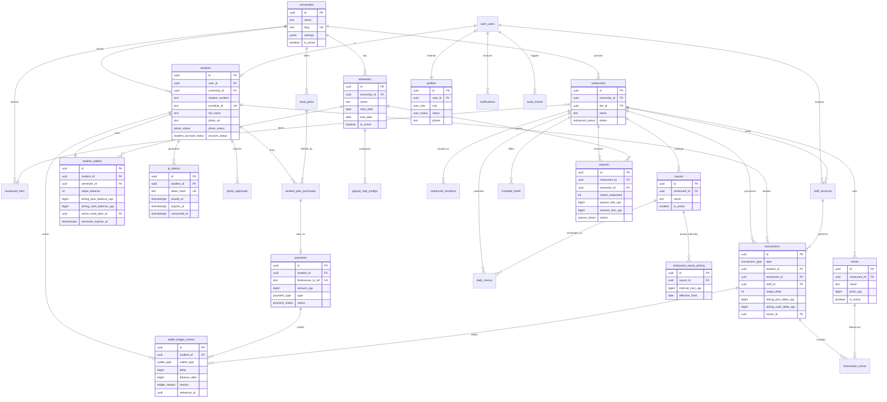
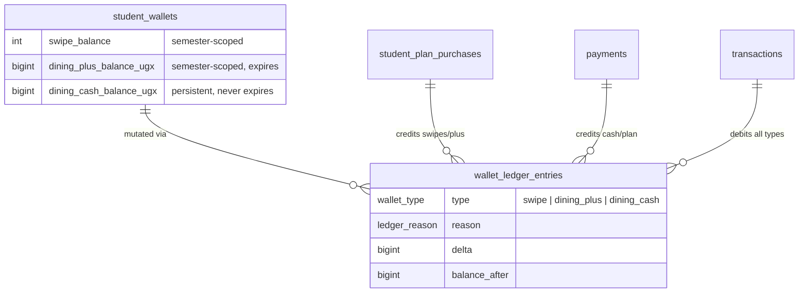
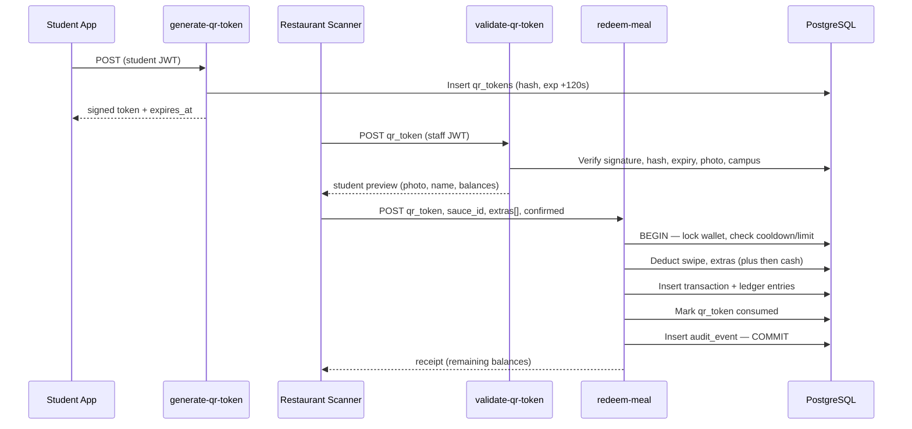

# LunchLink Technical Foundation

**Version:** 1.0  
**Status:** Production MVP foundation — documentation only (no UI code)  
**Sources:** [Platform Architecture](./platform-architecture.md) · [Design System](./design-system.md) · [Technical Specification](./technical-specification.md)

> **Note:** `LunchLink Business Rules.md` is not present in the repository. Business rules in this document are synthesized from the Technical Specification (Sections 2–15, approved for development) and the Platform Architecture. Where terminology differs, the Technical Specification takes precedence.

### Terminology Mapping

| Platform Architecture | Technical Specification | Implementation |
| --------------------- | ----------------------- | -------------- |
| Meal Swipes | Swipe Wallet | `swipe_balance` on semester wallet |
| LunchCredits (plan-included) | Dining Plus Wallet | `dining_plus_balance_ugx` |
| LunchCredits (top-up) | Dining Cash Wallet | `dining_cash_balance_ugx` |

Student-facing UI may display **“LunchCredits”** as the combined spending balance (Dining Plus + Dining Cash) while the backend maintains separate ledgers for expiry and deduction priority rules.

---

## Table of Contents

1. [Complete ER Diagram](#1-complete-er-diagram)
2. [Database Schema](#2-database-schema)
3. [Supabase Table Definitions](#3-supabase-table-definitions)
4. [Authentication Architecture](#4-authentication-architecture)
5. [Row Level Security Policies](#5-row-level-security-policies)
6. [Wallet Architecture](#6-wallet-architecture)
7. [QR Redemption Architecture](#7-qr-redemption-architecture)
8. [Flutterwave Integration Architecture](#8-flutterwave-integration-architecture)
9. [API Design](#9-api-design)
10. [Development Milestones](#10-development-milestones)

---

## 1. Complete ER Diagram

### 1.1 Domain Overview



### 1.2 Wallet & Ledger Sub-Diagram



### 1.3 Redemption Flow (Logical)



---

## 2. Database Schema

### 2.1 Design Principles

| Principle | Implementation |
| --------- | -------------- |
| University isolation | Every tenant-scoped row carries `university_id` or resolves through FK |
| Immutable audit trail | `wallet_ledger_entries` and `audit_events` are append-only (no UPDATE/DELETE for authenticated roles) |
| Balance integrity | Cached balances on `student_wallets`; every mutation writes a ledger entry in the same transaction |
| Price opacity | `restaurant_sauce_pricing` blocked from student role at RLS layer |
| Idempotency | Unique constraints on `payments.flutterwave_tx_ref`, redemption idempotency keys |
| Semester lifecycle | Swipes and Dining Plus scoped to active semester; expiry job zeros semester balances |

### 2.2 Enum Types

```sql
-- Defined in migration 001_enums.sql
CREATE TYPE user_role AS ENUM (
  'student',
  'restaurant_staff',
  'restaurant_manager',
  'admin'
);

CREATE TYPE user_status AS ENUM ('active', 'suspended', 'pending');

CREATE TYPE photo_status AS ENUM ('pending', 'approved', 'rejected');

CREATE TYPE student_account_status AS ENUM (
  'registered',
  'pending_verification',
  'active',
  'suspended'
);

CREATE TYPE restaurant_status AS ENUM (
  'pending',
  'active',
  'inactive',
  'suspended'
);

CREATE TYPE wallet_type AS ENUM ('swipe', 'dining_plus', 'dining_cash');

CREATE TYPE ledger_reason AS ENUM (
  'plan_purchase',
  'credit_top_up',
  'meal_redemption',
  'extra_purchase',
  'refund',
  'semester_expiry',
  'admin_adjustment'
);

CREATE TYPE transaction_type AS ENUM (
  'meal_redemption',
  'extra_only',
  'plan_purchase',
  'credit_top_up',
  'refund'
);

CREATE TYPE payment_type AS ENUM ('meal_plan', 'dining_cash_top_up');

CREATE TYPE payment_status AS ENUM (
  'pending',
  'processing',
  'success',
  'failed',
  'refunded'
);

CREATE TYPE payment_provider AS ENUM ('mtn_momo', 'airtel_money');

CREATE TYPE payout_status AS ENUM ('draft', 'pending', 'paid', 'cancelled');

CREATE TYPE notification_channel AS ENUM ('email', 'sms', 'push');

CREATE TYPE audit_action AS ENUM (
  'login',
  'qr_generated',
  'qr_validated',
  'meal_redeemed',
  'payment_initiated',
  'payment_completed',
  'payment_failed',
  'refund_issued',
  'wallet_credited',
  'wallet_debited',
  'photo_approved',
  'photo_rejected',
  'admin_action'
);
```

### 2.3 Entity Summary

| Table | Rows (est. MVP) | Purpose |
| ----- | --------------- | ------- |
| `universities` | 1–5 | Tenant root |
| `semesters` | 2–10 | Academic periods, expiry boundaries |
| `profiles` | All users | Role and status (extends auth.users) |
| `students` | 1k–50k | Student identity and verification |
| `student_wallets` | 1 per student | Cached balances (3 wallet types) |
| `wallet_ledger_entries` | High volume | Immutable balance mutations |
| `meal_plans` | 5–20 per university | Plan catalog |
| `student_plan_purchases` | Medium | Plan activation records |
| `restaurants` | 10–100 per university | Partner venues |
| `restaurant_tiers` | 2–5 per university | Payout tier grouping |
| `payout_rate_configs` | Per restaurant/semester | Configurable payout rates |
| `sauces` / `extras` / `daily_menus` | Medium | Restaurant catalog |
| `restaurant_sauce_pricing` | Medium | Internal costs (restricted) |
| `qr_tokens` | High (ephemeral) | Dynamic QR tracking |
| `transactions` | High | Redemption and purchase records |
| `payments` | Medium | Flutterwave payment records |
| `payouts` | Weekly batches | Restaurant compensation |
| `audit_events` | High | Immutable system audit log |
| `notifications` | Medium | User notifications queue |
| `refunds` | Low | Refund workflow |

### 2.4 Key Constraints & Business Rules (Database-Enforced)

| Rule | Enforcement |
| ---- | ----------- |
| 1 Swipe = 1 Meal | Redemption deducts exactly `-1` from `swipe_balance` |
| 3-hour redemption cooldown | Edge Function checks `MAX(created_at)` from `transactions` WHERE type = `meal_redemption` |
| 2 swipes/day max | Edge Function counts today's `meal_redemption` transactions |
| QR 2-minute TTL | `expires_at = issued_at + interval '2 minutes'` |
| QR single use | `consumed_at IS NULL` check; set on redemption |
| Extras: Dining Plus first | Edge Function deduction order in `redeem-meal` |
| Photo gate | `photo_status = 'approved'` required for redemption/purchase |
| Campus lock | Student `university_id` must match restaurant `university_id` |
| Swipe/Dining Plus expiry | pg_cron job at semester `end_date` zeros balances, writes `semester_expiry` ledger entries |
| Dining Cash never expires | No expiry job touches `dining_cash_balance_ugx` |
| Refunds as platform credit | Refunds credit `dining_cash_balance_ugx` only (not cash-out) |

---

## 3. Supabase Table Definitions

Migration files live under `supabase/migrations/`. Apply in numeric order.

### 3.1 Migration 002 — Core Tenancy

```sql
-- supabase/migrations/002_core_tenancy.sql

CREATE TABLE universities (
  id            UUID PRIMARY KEY DEFAULT gen_random_uuid(),
  name          TEXT NOT NULL,
  slug          TEXT NOT NULL UNIQUE,
  settings      JSONB NOT NULL DEFAULT '{}',
  is_active     BOOLEAN NOT NULL DEFAULT true,
  created_at    TIMESTAMPTZ NOT NULL DEFAULT now(),
  updated_at    TIMESTAMPTZ NOT NULL DEFAULT now()
);

CREATE TABLE semesters (
  id            UUID PRIMARY KEY DEFAULT gen_random_uuid(),
  university_id UUID NOT NULL REFERENCES universities(id) ON DELETE RESTRICT,
  name          TEXT NOT NULL,
  code          TEXT NOT NULL,
  start_date    DATE NOT NULL,
  end_date      DATE NOT NULL,
  is_active     BOOLEAN NOT NULL DEFAULT false,
  created_at    TIMESTAMPTZ NOT NULL DEFAULT now(),
  updated_at    TIMESTAMPTZ NOT NULL DEFAULT now(),
  UNIQUE (university_id, code),
  CHECK (end_date > start_date)
);

CREATE INDEX idx_semesters_university_active
  ON semesters (university_id, is_active)
  WHERE is_active = true;
```

### 3.2 Migration 003 — Users & Profiles

```sql
-- supabase/migrations/003_users_profiles.sql

CREATE TABLE profiles (
  id         UUID PRIMARY KEY DEFAULT gen_random_uuid(),
  user_id    UUID NOT NULL UNIQUE REFERENCES auth.users(id) ON DELETE CASCADE,
  role       user_role NOT NULL,
  status     user_status NOT NULL DEFAULT 'pending',
  phone      TEXT,
  created_at TIMESTAMPTZ NOT NULL DEFAULT now(),
  updated_at TIMESTAMPTZ NOT NULL DEFAULT now()
);

CREATE TABLE students (
  id              UUID PRIMARY KEY DEFAULT gen_random_uuid(),
  user_id         UUID NOT NULL UNIQUE REFERENCES auth.users(id) ON DELETE CASCADE,
  university_id   UUID NOT NULL REFERENCES universities(id) ON DELETE RESTRICT,
  semester_id     UUID NOT NULL REFERENCES semesters(id) ON DELETE RESTRICT,
  student_number  TEXT NOT NULL,
  lunchlink_id    TEXT NOT NULL UNIQUE,
  full_name       TEXT NOT NULL,
  email           TEXT NOT NULL,
  phone           TEXT NOT NULL,
  photo_url       TEXT,
  photo_status    photo_status NOT NULL DEFAULT 'pending',
  photo_rejection_reason TEXT,
  account_status  student_account_status NOT NULL DEFAULT 'registered',
  last_redemption_at TIMESTAMPTZ,
  created_at      TIMESTAMPTZ NOT NULL DEFAULT now(),
  updated_at      TIMESTAMPTZ NOT NULL DEFAULT now(),
  UNIQUE (university_id, student_number)
);

CREATE INDEX idx_students_university ON students (university_id);
CREATE INDEX idx_students_lunchlink_id ON students (lunchlink_id);
CREATE INDEX idx_students_photo_status ON students (photo_status)
  WHERE photo_status = 'pending';

CREATE TABLE photo_approvals (
  id          UUID PRIMARY KEY DEFAULT gen_random_uuid(),
  student_id  UUID NOT NULL REFERENCES students(id) ON DELETE CASCADE,
  reviewer_id UUID REFERENCES auth.users(id),
  status      photo_status NOT NULL,
  notes       TEXT,
  created_at  TIMESTAMPTZ NOT NULL DEFAULT now()
);
```

### 3.3 Migration 004 — Wallets

```sql
-- supabase/migrations/004_wallets.sql

CREATE TABLE student_wallets (
  id                       UUID PRIMARY KEY DEFAULT gen_random_uuid(),
  student_id               UUID NOT NULL UNIQUE REFERENCES students(id) ON DELETE CASCADE,
  semester_id                UUID NOT NULL REFERENCES semesters(id) ON DELETE RESTRICT,
  swipe_balance            INT NOT NULL DEFAULT 0 CHECK (swipe_balance >= 0),
  dining_plus_balance_ugx  BIGINT NOT NULL DEFAULT 0 CHECK (dining_plus_balance_ugx >= 0),
  dining_cash_balance_ugx  BIGINT NOT NULL DEFAULT 0 CHECK (dining_cash_balance_ugx >= 0),
  active_meal_plan_id      UUID,
  semester_expires_at      TIMESTAMPTZ NOT NULL,
  created_at               TIMESTAMPTZ NOT NULL DEFAULT now(),
  updated_at               TIMESTAMPTZ NOT NULL DEFAULT now()
);

CREATE TABLE wallet_ledger_entries (
  id              UUID PRIMARY KEY DEFAULT gen_random_uuid(),
  student_id      UUID NOT NULL REFERENCES students(id) ON DELETE RESTRICT,
  wallet_type     wallet_type NOT NULL,
  delta           BIGINT NOT NULL,
  balance_after   BIGINT NOT NULL,
  reason          ledger_reason NOT NULL,
  reference_type  TEXT,
  reference_id    UUID,
  metadata        JSONB NOT NULL DEFAULT '{}',
  created_at      TIMESTAMPTZ NOT NULL DEFAULT now()
);

CREATE INDEX idx_wallet_ledger_student_created
  ON wallet_ledger_entries (student_id, created_at DESC);

CREATE INDEX idx_wallet_ledger_reference
  ON wallet_ledger_entries (reference_type, reference_id);

-- Prevent mutation of ledger (append-only)
CREATE OR REPLACE FUNCTION prevent_ledger_mutation()
RETURNS TRIGGER AS $$
BEGIN
  RAISE EXCEPTION 'wallet_ledger_entries is append-only';
END;
$$ LANGUAGE plpgsql;

CREATE TRIGGER trg_wallet_ledger_no_update
  BEFORE UPDATE OR DELETE ON wallet_ledger_entries
  FOR EACH ROW EXECUTE FUNCTION prevent_ledger_mutation();
```

### 3.4 Migration 005 — Meal Plans & Purchases

```sql
-- supabase/migrations/005_meal_plans.sql

CREATE TABLE meal_plans (
  id                    UUID PRIMARY KEY DEFAULT gen_random_uuid(),
  university_id         UUID NOT NULL REFERENCES universities(id) ON DELETE RESTRICT,
  semester_id           UUID NOT NULL REFERENCES semesters(id) ON DELETE RESTRICT,
  name                  TEXT NOT NULL,
  description           TEXT,
  swipe_allocation      INT NOT NULL CHECK (swipe_allocation > 0),
  dining_plus_allocation_ugx BIGINT NOT NULL DEFAULT 0 CHECK (dining_plus_allocation_ugx >= 0),
  price_ugx             BIGINT NOT NULL CHECK (price_ugx > 0),
  is_active             BOOLEAN NOT NULL DEFAULT true,
  sort_order            INT NOT NULL DEFAULT 0,
  created_at            TIMESTAMPTZ NOT NULL DEFAULT now(),
  updated_at            TIMESTAMPTZ NOT NULL DEFAULT now()
);

CREATE TABLE student_plan_purchases (
  id              UUID PRIMARY KEY DEFAULT gen_random_uuid(),
  student_id      UUID NOT NULL REFERENCES students(id) ON DELETE RESTRICT,
  meal_plan_id    UUID NOT NULL REFERENCES meal_plans(id) ON DELETE RESTRICT,
  payment_id      UUID,
  swipes_granted  INT NOT NULL,
  dining_plus_granted_ugx BIGINT NOT NULL,
  activated_at    TIMESTAMPTZ NOT NULL DEFAULT now(),
  created_at      TIMESTAMPTZ NOT NULL DEFAULT now()
);

ALTER TABLE student_wallets
  ADD CONSTRAINT fk_active_meal_plan
  FOREIGN KEY (active_meal_plan_id) REFERENCES meal_plans(id);
```

### 3.5 Migration 006 — Restaurants & Catalog

```sql
-- supabase/migrations/006_restaurants.sql

CREATE TABLE restaurant_tiers (
  id                    UUID PRIMARY KEY DEFAULT gen_random_uuid(),
  university_id         UUID NOT NULL REFERENCES universities(id) ON DELETE RESTRICT,
  name                  TEXT NOT NULL,
  default_payout_rate_ugx BIGINT NOT NULL CHECK (default_payout_rate_ugx > 0),
  created_at            TIMESTAMPTZ NOT NULL DEFAULT now(),
  UNIQUE (university_id, name)
);

CREATE TABLE restaurants (
  id              UUID PRIMARY KEY DEFAULT gen_random_uuid(),
  university_id   UUID NOT NULL REFERENCES universities(id) ON DELETE RESTRICT,
  tier_id         UUID NOT NULL REFERENCES restaurant_tiers(id) ON DELETE RESTRICT,
  name            TEXT NOT NULL,
  slug            TEXT NOT NULL,
  description     TEXT,
  logo_url        TEXT,
  status          restaurant_status NOT NULL DEFAULT 'pending',
  operating_hours JSONB NOT NULL DEFAULT '{}',
  created_at      TIMESTAMPTZ NOT NULL DEFAULT now(),
  updated_at      TIMESTAMPTZ NOT NULL DEFAULT now(),
  UNIQUE (university_id, slug)
);

CREATE TABLE restaurant_locations (
  id            UUID PRIMARY KEY DEFAULT gen_random_uuid(),
  restaurant_id UUID NOT NULL REFERENCES restaurants(id) ON DELETE CASCADE,
  latitude      DOUBLE PRECISION NOT NULL,
  longitude     DOUBLE PRECISION NOT NULL,
  address       TEXT NOT NULL,
  is_primary    BOOLEAN NOT NULL DEFAULT false,
  created_at    TIMESTAMPTZ NOT NULL DEFAULT now()
);

CREATE TABLE staff_accounts (
  id            UUID PRIMARY KEY DEFAULT gen_random_uuid(),
  user_id       UUID NOT NULL REFERENCES auth.users(id) ON DELETE CASCADE,
  restaurant_id UUID NOT NULL REFERENCES restaurants(id) ON DELETE CASCADE,
  role          user_role NOT NULL CHECK (role IN ('restaurant_staff', 'restaurant_manager')),
  is_active     BOOLEAN NOT NULL DEFAULT true,
  created_at    TIMESTAMPTZ NOT NULL DEFAULT now(),
  UNIQUE (user_id, restaurant_id)
);

CREATE TABLE payout_rate_configs (
  id              UUID PRIMARY KEY DEFAULT gen_random_uuid(),
  restaurant_id   UUID NOT NULL REFERENCES restaurants(id) ON DELETE CASCADE,
  semester_id     UUID NOT NULL REFERENCES semesters(id) ON DELETE RESTRICT,
  payout_rate_ugx BIGINT NOT NULL CHECK (payout_rate_ugx > 0),
  effective_from  DATE NOT NULL DEFAULT CURRENT_DATE,
  created_at      TIMESTAMPTZ NOT NULL DEFAULT now(),
  UNIQUE (restaurant_id, semester_id)
);

CREATE TABLE sauces (
  id            UUID PRIMARY KEY DEFAULT gen_random_uuid(),
  restaurant_id UUID NOT NULL REFERENCES restaurants(id) ON DELETE CASCADE,
  name          TEXT NOT NULL,
  is_active     BOOLEAN NOT NULL DEFAULT true,
  created_at    TIMESTAMPTZ NOT NULL DEFAULT now(),
  UNIQUE (restaurant_id, name)
);

CREATE TABLE restaurant_sauce_pricing (
  id                UUID PRIMARY KEY DEFAULT gen_random_uuid(),
  sauce_id          UUID NOT NULL REFERENCES sauces(id) ON DELETE CASCADE,
  internal_cost_ugx BIGINT NOT NULL CHECK (internal_cost_ugx > 0),
  effective_from    DATE NOT NULL DEFAULT CURRENT_DATE,
  effective_to      DATE,
  created_at        TIMESTAMPTZ NOT NULL DEFAULT now()
);

CREATE TABLE included_foods (
  id            UUID PRIMARY KEY DEFAULT gen_random_uuid(),
  restaurant_id UUID NOT NULL REFERENCES restaurants(id) ON DELETE CASCADE,
  name          TEXT NOT NULL,
  is_active     BOOLEAN NOT NULL DEFAULT true,
  UNIQUE (restaurant_id, name)
);

CREATE TABLE extras (
  id            UUID PRIMARY KEY DEFAULT gen_random_uuid(),
  restaurant_id UUID NOT NULL REFERENCES restaurants(id) ON DELETE CASCADE,
  name          TEXT NOT NULL,
  price_ugx     BIGINT NOT NULL CHECK (price_ugx > 0),
  is_active     BOOLEAN NOT NULL DEFAULT true,
  created_at    TIMESTAMPTZ NOT NULL DEFAULT now(),
  updated_at    TIMESTAMPTZ NOT NULL DEFAULT now(),
  UNIQUE (restaurant_id, name)
);

CREATE TABLE daily_menus (
  id            UUID PRIMARY KEY DEFAULT gen_random_uuid(),
  restaurant_id UUID NOT NULL REFERENCES restaurants(id) ON DELETE CASCADE,
  sauce_id      UUID NOT NULL REFERENCES sauces(id) ON DELETE CASCADE,
  menu_date     DATE NOT NULL DEFAULT CURRENT_DATE,
  is_available  BOOLEAN NOT NULL DEFAULT true,
  stock_remaining INT,
  created_at    TIMESTAMPTZ NOT NULL DEFAULT now(),
  UNIQUE (restaurant_id, sauce_id, menu_date)
);

CREATE INDEX idx_daily_menus_restaurant_date
  ON daily_menus (restaurant_id, menu_date);
```

### 3.6 Migration 007 — QR, Transactions, Payments

```sql
-- supabase/migrations/007_transactions_payments.sql

CREATE TABLE qr_tokens (
  id                      UUID PRIMARY KEY DEFAULT gen_random_uuid(),
  student_id              UUID NOT NULL REFERENCES students(id) ON DELETE CASCADE,
  token_hash              TEXT NOT NULL UNIQUE,
  jti                     UUID NOT NULL UNIQUE,
  issued_at               TIMESTAMPTZ NOT NULL DEFAULT now(),
  expires_at              TIMESTAMPTZ NOT NULL,
  consumed_at             TIMESTAMPTZ,
  consumed_by_staff_id    UUID REFERENCES staff_accounts(id),
  consumed_at_restaurant_id UUID REFERENCES restaurants(id),
  device_fingerprint      TEXT,
  created_at              TIMESTAMPTZ NOT NULL DEFAULT now(),
  CHECK (expires_at > issued_at)
);

CREATE INDEX idx_qr_tokens_student_active
  ON qr_tokens (student_id, consumed_at)
  WHERE consumed_at IS NULL;

CREATE INDEX idx_qr_tokens_expires
  ON qr_tokens (expires_at)
  WHERE consumed_at IS NULL;

CREATE TABLE transactions (
  id                      UUID PRIMARY KEY DEFAULT gen_random_uuid(),
  type                    transaction_type NOT NULL,
  student_id              UUID NOT NULL REFERENCES students(id) ON DELETE RESTRICT,
  restaurant_id           UUID REFERENCES restaurants(id) ON DELETE RESTRICT,
  staff_id                UUID REFERENCES staff_accounts(id) ON DELETE RESTRICT,
  sauce_id                UUID REFERENCES sauces(id) ON DELETE RESTRICT,
  swipe_delta             INT NOT NULL DEFAULT 0,
  dining_plus_delta_ugx   BIGINT NOT NULL DEFAULT 0,
  dining_cash_delta_ugx   BIGINT NOT NULL DEFAULT 0,
  idempotency_key         TEXT UNIQUE,
  metadata                JSONB NOT NULL DEFAULT '{}',
  created_at              TIMESTAMPTZ NOT NULL DEFAULT now()
);

CREATE TABLE transaction_extras (
  id              UUID PRIMARY KEY DEFAULT gen_random_uuid(),
  transaction_id  UUID NOT NULL REFERENCES transactions(id) ON DELETE CASCADE,
  extra_id        UUID NOT NULL REFERENCES extras(id) ON DELETE RESTRICT,
  quantity        INT NOT NULL CHECK (quantity > 0),
  unit_price_ugx  BIGINT NOT NULL,
  total_price_ugx BIGINT NOT NULL,
  dining_plus_used_ugx BIGINT NOT NULL DEFAULT 0,
  dining_cash_used_ugx BIGINT NOT NULL DEFAULT 0
);

CREATE INDEX idx_transactions_student_created
  ON transactions (student_id, created_at DESC);

CREATE INDEX idx_transactions_restaurant_created
  ON transactions (restaurant_id, created_at DESC);

CREATE INDEX idx_transactions_redemption_daily
  ON transactions (student_id, created_at)
  WHERE type = 'meal_redemption';

CREATE TABLE payments (
  id                  UUID PRIMARY KEY DEFAULT gen_random_uuid(),
  student_id          UUID NOT NULL REFERENCES students(id) ON DELETE RESTRICT,
  type                payment_type NOT NULL,
  provider            payment_provider NOT NULL,
  amount_ugx          BIGINT NOT NULL CHECK (amount_ugx > 0),
  flutterwave_tx_ref  TEXT NOT NULL UNIQUE,
  flutterwave_id      TEXT,
  status              payment_status NOT NULL DEFAULT 'pending',
  meal_plan_id        UUID REFERENCES meal_plans(id),
  phone_number        TEXT NOT NULL,
  metadata            JSONB NOT NULL DEFAULT '{}',
  completed_at        TIMESTAMPTZ,
  created_at          TIMESTAMPTZ NOT NULL DEFAULT now(),
  updated_at          TIMESTAMPTZ NOT NULL DEFAULT now()
);

ALTER TABLE student_plan_purchases
  ADD CONSTRAINT fk_plan_purchase_payment
  FOREIGN KEY (payment_id) REFERENCES payments(id);
```

### 3.7 Migration 008 — Payouts, Notifications, Audit, Refunds

```sql
-- supabase/migrations/008_ops_tables.sql

CREATE TABLE payouts (
  id                UUID PRIMARY KEY DEFAULT gen_random_uuid(),
  restaurant_id     UUID NOT NULL REFERENCES restaurants(id) ON DELETE RESTRICT,
  semester_id       UUID NOT NULL REFERENCES semesters(id) ON DELETE RESTRICT,
  period_start      DATE NOT NULL,
  period_end        DATE NOT NULL,
  meals_redeemed    INT NOT NULL DEFAULT 0,
  payout_rate_ugx   BIGINT NOT NULL,
  amount_due_ugx    BIGINT NOT NULL,
  status            payout_status NOT NULL DEFAULT 'draft',
  paid_at           TIMESTAMPTZ,
  created_at        TIMESTAMPTZ NOT NULL DEFAULT now(),
  UNIQUE (restaurant_id, period_start, period_end)
);

CREATE TABLE notifications (
  id          UUID PRIMARY KEY DEFAULT gen_random_uuid(),
  user_id     UUID NOT NULL REFERENCES auth.users(id) ON DELETE CASCADE,
  channel     notification_channel NOT NULL,
  event_type  TEXT NOT NULL,
  title       TEXT NOT NULL,
  body        TEXT NOT NULL,
  payload     JSONB NOT NULL DEFAULT '{}',
  read_at     TIMESTAMPTZ,
  sent_at     TIMESTAMPTZ,
  created_at  TIMESTAMPTZ NOT NULL DEFAULT now()
);

CREATE TABLE audit_events (
  id          UUID PRIMARY KEY DEFAULT gen_random_uuid(),
  actor_id    UUID REFERENCES auth.users(id),
  action      audit_action NOT NULL,
  entity_type TEXT NOT NULL,
  entity_id   UUID,
  payload     JSONB NOT NULL DEFAULT '{}',
  ip_address  INET,
  user_agent  TEXT,
  created_at  TIMESTAMPTZ NOT NULL DEFAULT now()
);

CREATE INDEX idx_audit_events_created ON audit_events (created_at DESC);
CREATE INDEX idx_audit_events_actor ON audit_events (actor_id, created_at DESC);

CREATE OR REPLACE FUNCTION prevent_audit_mutation()
RETURNS TRIGGER AS $$
BEGIN
  RAISE EXCEPTION 'audit_events is append-only';
END;
$$ LANGUAGE plpgsql;

CREATE TRIGGER trg_audit_events_no_update
  BEFORE UPDATE OR DELETE ON audit_events
  FOR EACH ROW EXECUTE FUNCTION prevent_audit_mutation();

CREATE TABLE refunds (
  id              UUID PRIMARY KEY DEFAULT gen_random_uuid(),
  student_id      UUID NOT NULL REFERENCES students(id) ON DELETE RESTRICT,
  payment_id      UUID REFERENCES payments(id),
  transaction_id  UUID REFERENCES transactions(id),
  amount_ugx      BIGINT NOT NULL CHECK (amount_ugx > 0),
  reason          TEXT NOT NULL,
  issued_by       UUID NOT NULL REFERENCES auth.users(id),
  ledger_entry_id UUID REFERENCES wallet_ledger_entries(id),
  created_at      TIMESTAMPTZ NOT NULL DEFAULT now()
);
```

### 3.8 Migration 009 — Database Functions

```sql
-- supabase/migrations/009_functions.sql

-- JWT helper: role from profiles
CREATE OR REPLACE FUNCTION auth.user_role()
RETURNS user_role
LANGUAGE sql STABLE SECURITY DEFINER SET search_path = public
AS $$
  SELECT p.role FROM profiles p WHERE p.user_id = auth.uid();
$$;

-- JWT helper: student_id for current user
CREATE OR REPLACE FUNCTION auth.student_id()
RETURNS UUID
LANGUAGE sql STABLE SECURITY DEFINER SET search_path = public
AS $$
  SELECT s.id FROM students s WHERE s.user_id = auth.uid();
$$;

-- JWT helper: university_id (student or staff context)
CREATE OR REPLACE FUNCTION auth.university_id()
RETURNS UUID
LANGUAGE sql STABLE SECURITY DEFINER SET search_path = public
AS $$
  SELECT COALESCE(
    (SELECT s.university_id FROM students s WHERE s.user_id = auth.uid()),
    (SELECT r.university_id FROM staff_accounts sa
     JOIN restaurants r ON r.id = sa.restaurant_id
     WHERE sa.user_id = auth.uid() AND sa.is_active = true
     LIMIT 1)
  );
$$;

-- JWT helper: restaurant_id for staff
CREATE OR REPLACE FUNCTION auth.restaurant_id()
RETURNS UUID
LANGUAGE sql STABLE SECURITY DEFINER SET search_path = public
AS $$
  SELECT sa.restaurant_id FROM staff_accounts sa
  WHERE sa.user_id = auth.uid() AND sa.is_active = true
  LIMIT 1;
$$;

-- Atomic wallet mutation (called from Edge Functions via service role)
CREATE OR REPLACE FUNCTION apply_wallet_delta(
  p_student_id UUID,
  p_wallet_type wallet_type,
  p_delta BIGINT,
  p_reason ledger_reason,
  p_reference_type TEXT,
  p_reference_id UUID,
  p_metadata JSONB DEFAULT '{}'
)
RETURNS wallet_ledger_entries
LANGUAGE plpgsql SECURITY DEFINER SET search_path = public
AS $$
DECLARE
  v_wallet student_wallets%ROWTYPE;
  v_balance_after BIGINT;
  v_entry wallet_ledger_entries%ROWTYPE;
BEGIN
  SELECT * INTO v_wallet FROM student_wallets
  WHERE student_id = p_student_id
  FOR UPDATE;

  IF NOT FOUND THEN
    RAISE EXCEPTION 'WALLET_NOT_FOUND';
  END IF;

  CASE p_wallet_type
    WHEN 'swipe' THEN
      IF v_wallet.swipe_balance + p_delta::INT < 0 THEN
        RAISE EXCEPTION 'INSUFFICIENT_SWIPES';
      END IF;
      UPDATE student_wallets
        SET swipe_balance = swipe_balance + p_delta::INT, updated_at = now()
        WHERE student_id = p_student_id
        RETURNING swipe_balance INTO v_balance_after;

    WHEN 'dining_plus' THEN
      IF v_wallet.dining_plus_balance_ugx + p_delta < 0 THEN
        RAISE EXCEPTION 'INSUFFICIENT_DINING_PLUS';
      END IF;
      UPDATE student_wallets
        SET dining_plus_balance_ugx = dining_plus_balance_ugx + p_delta, updated_at = now()
        WHERE student_id = p_student_id
        RETURNING dining_plus_balance_ugx INTO v_balance_after;

    WHEN 'dining_cash' THEN
      IF v_wallet.dining_cash_balance_ugx + p_delta < 0 THEN
        RAISE EXCEPTION 'INSUFFICIENT_DINING_CASH';
      END IF;
      UPDATE student_wallets
        SET dining_cash_balance_ugx = dining_cash_balance_ugx + p_delta, updated_at = now()
        WHERE student_id = p_student_id
        RETURNING dining_cash_balance_ugx INTO v_balance_after;
  END CASE;

  INSERT INTO wallet_ledger_entries (
    student_id, wallet_type, delta, balance_after,
    reason, reference_type, reference_id, metadata
  ) VALUES (
    p_student_id, p_wallet_type, p_delta, v_balance_after,
    p_reason, p_reference_type, p_reference_id, p_metadata
  ) RETURNING * INTO v_entry;

  RETURN v_entry;
END;
$$;

-- Redemption eligibility check
CREATE OR REPLACE FUNCTION check_redemption_eligibility(p_student_id UUID)
RETURNS TABLE (eligible BOOLEAN, reason_code TEXT)
LANGUAGE plpgsql STABLE SECURITY DEFINER SET search_path = public
AS $$
DECLARE
  v_student students%ROWTYPE;
  v_wallet student_wallets%ROWTYPE;
  v_today_count INT;
  v_last_redemption TIMESTAMPTZ;
BEGIN
  SELECT * INTO v_student FROM students WHERE id = p_student_id;
  SELECT * INTO v_wallet FROM student_wallets WHERE student_id = p_student_id;

  IF v_student.photo_status != 'approved' THEN
    RETURN QUERY SELECT false, 'PHOTO_NOT_APPROVED';
    RETURN;
  END IF;

  IF v_student.account_status != 'active' THEN
    RETURN QUERY SELECT false, 'ACCOUNT_NOT_ACTIVE';
    RETURN;
  END IF;

  IF v_wallet.swipe_balance < 1 THEN
    RETURN QUERY SELECT false, 'INSUFFICIENT_SWIPES';
    RETURN;
  END IF;

  SELECT COUNT(*) INTO v_today_count
  FROM transactions
  WHERE student_id = p_student_id
    AND type = 'meal_redemption'
    AND created_at >= date_trunc('day', now() AT TIME ZONE 'Africa/Kampala');

  IF v_today_count >= 2 THEN
    RETURN QUERY SELECT false, 'DAILY_LIMIT_EXCEEDED';
    RETURN;
  END IF;

  SELECT MAX(created_at) INTO v_last_redemption
  FROM transactions
  WHERE student_id = p_student_id AND type = 'meal_redemption';

  IF v_last_redemption IS NOT NULL
     AND v_last_redemption > now() - interval '3 hours' THEN
    RETURN QUERY SELECT false, 'COOLDOWN_ACTIVE';
    RETURN;
  END IF;

  RETURN QUERY SELECT true, NULL::TEXT;
END;
$$;
```

### 3.9 Migration 010 — Updated Timestamps Trigger

```sql
-- supabase/migrations/010_triggers.sql

CREATE OR REPLACE FUNCTION set_updated_at()
RETURNS TRIGGER AS $$
BEGIN
  NEW.updated_at = now();
  RETURN NEW;
END;
$$ LANGUAGE plpgsql;

CREATE TRIGGER trg_universities_updated BEFORE UPDATE ON universities
  FOR EACH ROW EXECUTE FUNCTION set_updated_at();
CREATE TRIGGER trg_students_updated BEFORE UPDATE ON students
  FOR EACH ROW EXECUTE FUNCTION set_updated_at();
CREATE TRIGGER trg_student_wallets_updated BEFORE UPDATE ON student_wallets
  FOR EACH ROW EXECUTE FUNCTION set_updated_at();
CREATE TRIGGER trg_restaurants_updated BEFORE UPDATE ON restaurants
  FOR EACH ROW EXECUTE FUNCTION set_updated_at();
CREATE TRIGGER trg_payments_updated BEFORE UPDATE ON payments
  FOR EACH ROW EXECUTE FUNCTION set_updated_at();
```

### 3.10 Storage Buckets

```sql
-- supabase/migrations/011_storage.sql

INSERT INTO storage.buckets (id, name, public, file_size_limit, allowed_mime_types)
VALUES
  ('student-photos', 'student-photos', false, 5242880, ARRAY['image/jpeg', 'image/png', 'image/webp']),
  ('restaurant-assets', 'restaurant-assets', true, 2097152, ARRAY['image/jpeg', 'image/png', 'image/webp'])
ON CONFLICT (id) DO NOTHING;
```

---

## 4. Authentication Architecture

### 4.1 Identity Model

```
auth.users (Supabase Auth)
    │
    ├── profiles (role, status, phone)
    │
    ├── students (if role = student)
    │       └── student_wallets
    │
    └── staff_accounts (if role = restaurant_staff | restaurant_manager)
```

All authentication flows through **Supabase Auth**. Domain identity and authorization live in `profiles` and role-specific tables. Roles are **never** writable by client applications.

### 4.2 JWT Custom Claims

Set via Supabase Auth Hook (`custom_access_token_hook`) or post-registration Edge Function on login refresh:

```json
{
  "role": "student",
  "university_id": "uuid",
  "student_id": "uuid",
  "restaurant_id": null,
  "photo_status": "approved",
  "account_status": "active"
}
```

Restaurant staff JWT:

```json
{
  "role": "restaurant_staff",
  "university_id": "uuid",
  "restaurant_id": "uuid",
  "student_id": null
}
```

Claims enable middleware routing without extra DB round-trips. **Authoritative checks** still occur in RLS and Edge Functions.

### 4.3 Registration Flows

#### Student Registration

| Step | Actor | Action |
| ---- | ----- | ------ |
| 1 | Student | Submit form: name, email, phone, student number, university |
| 2 | Client | `supabase.auth.signUp()` |
| 3 | Edge Function `on-student-register` | Create `profiles`, `students`, `student_wallets`; generate `lunchlink_id` |
| 4 | Student | Upload photo → Storage `student-photos/{student_id}/` |
| 5 | System | Set `photo_status = pending`, `account_status = pending_verification` |
| 6 | Admin | Approve/reject via admin portal |
| 7 | System | On approve: `photo_status = approved`, `account_status = active` |

#### Restaurant Registration

| Step | Actor | Action |
| ---- | ----- | ------ |
| 1 | Manager | Submit restaurant application on public site |
| 2 | Admin | Review, create `restaurants`, `staff_accounts`, invite manager |
| 3 | Manager | Accept invite, set password |

#### Staff Invitation

Manager calls Edge Function `invite-staff` → Supabase Admin API sends invite email → creates `profiles` + `staff_accounts` on acceptance.

### 4.4 Session & Access Gates

| Gate | Condition | Blocked Actions |
| ---- | --------- | --------------- |
| Unauthenticated | No session | All portals except public |
| Pending photo | `photo_status != approved` | QR generation, payments, redemption |
| Suspended | `account_status = suspended` | All student actions |
| Wrong role | Role mismatch for route group | Portal access |
| Campus lock | Cross-university resource access | All data reads/writes |

### 4.5 Auth Methods (MVP)

| Method | Priority | Usage |
| ------ | -------- | ----- |
| Email + password | Primary | All roles |
| Email confirmation | Required | Student registration |
| Magic link | Optional | Password recovery |
| Phone OTP | Phase 2 | Uganda mobile-first enhancement |

### 4.6 Security Controls

- JWT expiry: 1 hour; refresh token rotation enabled
- Service role key: Edge Functions and Next.js server routes only
- MFA: Admin accounts (recommended pre-production)
- Device fingerprint: Stored on QR generation for fraud correlation
- Session invalidation on account suspension via Auth Admin API

---

## 5. Row Level Security Policies

**Global rule:** RLS enabled on every table in the public schema. No table without at least one policy.

### 5.1 Helper Predicate Summary

| Function | Returns |
| -------- | ------- |
| `auth.user_role()` | Current user's role |
| `auth.student_id()` | Student UUID for current user |
| `auth.university_id()` | University UUID (student or staff) |
| `auth.restaurant_id()` | Restaurant UUID for staff |

### 5.2 Policy Definitions

```sql
-- supabase/migrations/012_rls.sql

ALTER TABLE universities ENABLE ROW LEVEL SECURITY;
ALTER TABLE semesters ENABLE ROW LEVEL SECURITY;
ALTER TABLE profiles ENABLE ROW LEVEL SECURITY;
ALTER TABLE students ENABLE ROW LEVEL SECURITY;
ALTER TABLE student_wallets ENABLE ROW LEVEL SECURITY;
ALTER TABLE wallet_ledger_entries ENABLE ROW LEVEL SECURITY;
ALTER TABLE meal_plans ENABLE ROW LEVEL SECURITY;
ALTER TABLE restaurants ENABLE ROW LEVEL SECURITY;
ALTER TABLE restaurant_sauce_pricing ENABLE ROW LEVEL SECURITY;
ALTER TABLE extras ENABLE ROW LEVEL SECURITY;
ALTER TABLE daily_menus ENABLE ROW LEVEL SECURITY;
ALTER TABLE sauces ENABLE ROW LEVEL SECURITY;
ALTER TABLE included_foods ENABLE ROW LEVEL SECURITY;
ALTER TABLE transactions ENABLE ROW LEVEL SECURITY;
ALTER TABLE transaction_extras ENABLE ROW LEVEL SECURITY;
ALTER TABLE payments ENABLE ROW LEVEL SECURITY;
ALTER TABLE qr_tokens ENABLE ROW LEVEL SECURITY;
ALTER TABLE payouts ENABLE ROW LEVEL SECURITY;
ALTER TABLE notifications ENABLE ROW LEVEL SECURITY;
ALTER TABLE audit_events ENABLE ROW LEVEL SECURITY;
ALTER TABLE staff_accounts ENABLE ROW LEVEL SECURITY;
ALTER TABLE photo_approvals ENABLE ROW LEVEL SECURITY;

-- universities: public read active; admin write
CREATE POLICY universities_select ON universities FOR SELECT USING (
  is_active = true OR auth.user_role() = 'admin'
);
CREATE POLICY universities_admin ON universities FOR ALL USING (
  auth.user_role() = 'admin'
);

-- semesters: users see own university semesters
CREATE POLICY semesters_select ON semesters FOR SELECT USING (
  university_id = auth.university_id() OR auth.user_role() = 'admin'
);
CREATE POLICY semesters_admin ON semesters FOR ALL USING (
  auth.user_role() = 'admin'
);

-- profiles: own row + admin
CREATE POLICY profiles_select_own ON profiles FOR SELECT USING (
  user_id = auth.uid() OR auth.user_role() = 'admin'
);
CREATE POLICY profiles_update_own ON profiles FOR UPDATE USING (
  user_id = auth.uid()
);

-- students: own row; restaurant staff see limited fields via Edge Function only
-- Direct SELECT restricted to own record for students
CREATE POLICY students_select_own ON students FOR SELECT USING (
  user_id = auth.uid() OR auth.user_role() = 'admin'
);
CREATE POLICY students_update_own ON students FOR UPDATE USING (
  user_id = auth.uid()
) WITH CHECK (
  user_id = auth.uid()
);
CREATE POLICY students_admin ON students FOR ALL USING (
  auth.user_role() = 'admin'
);

-- student_wallets: own wallet only
CREATE POLICY wallets_select_own ON student_wallets FOR SELECT USING (
  student_id = auth.student_id() OR auth.user_role() = 'admin'
);

-- wallet_ledger: own entries only
CREATE POLICY ledger_select_own ON wallet_ledger_entries FOR SELECT USING (
  student_id = auth.student_id() OR auth.user_role() = 'admin'
);

-- meal_plans: campus students + admin
CREATE POLICY meal_plans_select ON meal_plans FOR SELECT USING (
  (university_id = auth.university_id() AND is_active = true)
  OR auth.user_role() = 'admin'
);
CREATE POLICY meal_plans_admin ON meal_plans FOR ALL USING (
  auth.user_role() = 'admin'
);

-- restaurants: campus users see active restaurants
CREATE POLICY restaurants_select ON restaurants FOR SELECT USING (
  (university_id = auth.university_id() AND status = 'active')
  OR auth.user_role() IN ('restaurant_staff', 'restaurant_manager')
  OR auth.user_role() = 'admin'
);
CREATE POLICY restaurants_manager ON restaurants FOR UPDATE USING (
  id = auth.restaurant_id() AND auth.user_role() = 'restaurant_manager'
);
CREATE POLICY restaurants_admin ON restaurants FOR ALL USING (
  auth.user_role() = 'admin'
);

-- restaurant_sauce_pricing: MANAGER + ADMIN ONLY — students explicitly denied
CREATE POLICY sauce_pricing_manager ON restaurant_sauce_pricing FOR SELECT USING (
  auth.user_role() IN ('restaurant_manager', 'admin')
  AND EXISTS (
    SELECT 1 FROM sauces s
    JOIN restaurants r ON r.id = s.restaurant_id
    WHERE s.id = sauce_id
      AND (r.id = auth.restaurant_id() OR auth.user_role() = 'admin')
  )
);
CREATE POLICY sauce_pricing_manager_write ON restaurant_sauce_pricing FOR ALL USING (
  auth.user_role() IN ('restaurant_manager', 'admin')
);

-- sauces, extras, daily_menus, included_foods: campus read; manager write own restaurant
CREATE POLICY sauces_select ON sauces FOR SELECT USING (
  EXISTS (
    SELECT 1 FROM restaurants r
    WHERE r.id = restaurant_id
      AND r.university_id = auth.university_id()
      AND r.status = 'active'
  ) OR auth.user_role() = 'admin'
    OR restaurant_id = auth.restaurant_id()
);
CREATE POLICY sauces_manager ON sauces FOR ALL USING (
  restaurant_id = auth.restaurant_id()
  AND auth.user_role() = 'restaurant_manager'
);

CREATE POLICY extras_select ON extras FOR SELECT USING (
  EXISTS (
    SELECT 1 FROM restaurants r
    WHERE r.id = restaurant_id
      AND r.university_id = auth.university_id()
      AND r.status = 'active'
  ) OR restaurant_id = auth.restaurant_id()
    OR auth.user_role() = 'admin'
);
CREATE POLICY extras_manager ON extras FOR ALL USING (
  restaurant_id = auth.restaurant_id()
  AND auth.user_role() = 'restaurant_manager'
);

CREATE POLICY daily_menus_select ON daily_menus FOR SELECT USING (
  EXISTS (
    SELECT 1 FROM restaurants r
    WHERE r.id = restaurant_id
      AND r.university_id = auth.university_id()
  ) OR restaurant_id = auth.restaurant_id()
    OR auth.user_role() = 'admin'
);
CREATE POLICY daily_menus_manager ON daily_menus FOR ALL USING (
  restaurant_id = auth.restaurant_id()
  AND auth.user_role() IN ('restaurant_staff', 'restaurant_manager')
);

-- transactions
CREATE POLICY transactions_student ON transactions FOR SELECT USING (
  student_id = auth.student_id() OR auth.user_role() = 'admin'
);
CREATE POLICY transactions_restaurant ON transactions FOR SELECT USING (
  restaurant_id = auth.restaurant_id()
  AND auth.user_role() IN ('restaurant_staff', 'restaurant_manager')
);

-- payments: own only
CREATE POLICY payments_student ON payments FOR SELECT USING (
  student_id = auth.student_id() OR auth.user_role() = 'admin'
);

-- qr_tokens: no direct client access — Edge Functions use service role
CREATE POLICY qr_tokens_deny_all ON qr_tokens FOR ALL USING (false);

-- payouts: manager own restaurant + admin
CREATE POLICY payouts_manager ON payouts FOR SELECT USING (
  restaurant_id = auth.restaurant_id()
  AND auth.user_role() = 'restaurant_manager'
);
CREATE POLICY payouts_admin ON payouts FOR ALL USING (
  auth.user_role() = 'admin'
);

-- notifications: own only
CREATE POLICY notifications_own ON notifications FOR SELECT USING (
  user_id = auth.uid()
);
CREATE POLICY notifications_update_own ON notifications FOR UPDATE USING (
  user_id = auth.uid()
);

-- audit_events: admin read only; inserts via service role
CREATE POLICY audit_admin_read ON audit_events FOR SELECT USING (
  auth.user_role() = 'admin'
);

-- staff_accounts
CREATE POLICY staff_manager ON staff_accounts FOR ALL USING (
  restaurant_id = auth.restaurant_id()
  AND auth.user_role() = 'restaurant_manager'
);
CREATE POLICY staff_admin ON staff_accounts FOR ALL USING (
  auth.user_role() = 'admin'
);

-- photo_approvals: admin only
CREATE POLICY photo_approvals_admin ON photo_approvals FOR ALL USING (
  auth.user_role() = 'admin'
);
```

### 5.3 Storage RLS

```sql
-- Student photos: owner upload, admin read, restaurant read via signed URL from Edge Function
CREATE POLICY student_photos_upload ON storage.objects FOR INSERT WITH CHECK (
  bucket_id = 'student-photos'
  AND auth.user_role() = 'student'
  AND (storage.foldername(name))[1] = auth.student_id()::text
);

CREATE POLICY student_photos_read_own ON storage.objects FOR SELECT USING (
  bucket_id = 'student-photos'
  AND (
    (storage.foldername(name))[1] = auth.student_id()::text
    OR auth.user_role() = 'admin'
  )
);
```

Restaurant staff receive student photos **only** through the `validate-qr-token` Edge Function response (signed URL, 60-second TTL) — never direct Storage access.

---

## 6. Wallet Architecture

### 6.1 Three-Wallet Model

Per the Technical Specification, every student account maintains three distinct balances:

| Wallet | Column | Source | Expiry | Withdrawable |
| ------ | ------ | ------ | ------ | ------------ |
| **Swipe** | `swipe_balance` | Meal plan purchase | End of semester | No |
| **Dining Plus** | `dining_plus_balance_ugx` | Included in meal plan | End of semester | No |
| **Dining Cash** | `dining_cash_balance_ugx` | Student top-up, refunds | Never | No (platform credit only) |

All three balances live on a single `student_wallets` row for atomic multi-wallet operations during redemption.

### 6.2 Balance vs Ledger

```
┌─────────────────────┐         ┌──────────────────────────┐
│  student_wallets    │         │  wallet_ledger_entries   │
│  (cached balances)  │◄────────│  (source of truth log)   │
│                     │  write  │                          │
│  swipe_balance      │  pair   │  delta, balance_after,   │
│  dining_plus_...    │         │  reason, reference       │
│  dining_cash_...    │         │                          │
└─────────────────────┘         └──────────────────────────┘
```

Every balance mutation calls `apply_wallet_delta()` which updates the cache and inserts a ledger row in one transaction. Ledger is append-only.

### 6.3 Credit Flows

#### Meal Plan Purchase (payment success)

```
payments.status → success
  → apply_wallet_delta(swipe, +N, plan_purchase)
  → apply_wallet_delta(dining_plus, +M, plan_purchase)
  → insert student_plan_purchases
  → update active_meal_plan_id on student_wallets
```

#### Dining Cash Top-Up

```
payments.status → success
  → apply_wallet_delta(dining_cash, +amount, credit_top_up)
```

#### Meal Redemption (no extras)

```
apply_wallet_delta(swipe, -1, meal_redemption)
```

#### Extras During Redemption

Deduction priority (Technical Specification §9):

```
total_extra_cost = Σ(extra.price × quantity)

1. dining_plus_used  = MIN(dining_plus_balance, total_extra_cost)
2. dining_cash_used  = total_extra_cost - dining_plus_used

IF dining_plus_used + dining_cash_used < total_extra_cost → reject

apply_wallet_delta(dining_plus, -dining_plus_used, extra_purchase)
apply_wallet_delta(dining_cash, -dining_cash_used, extra_purchase)
```

#### Refund (admin-initiated)

```
Refunds credit dining_cash ONLY (platform credit, not cash-out)
apply_wallet_delta(dining_cash, +amount, refund)
insert refunds record
```

### 6.4 Semester Expiry Job

pg_cron weekly + daily check on `semesters.end_date`:

```sql
-- For each expired semester wallet:
apply_wallet_delta(swipe, -swipe_balance, semester_expiry)  -- if balance > 0
apply_wallet_delta(dining_plus, -dining_plus_balance_ugx, semester_expiry)
-- dining_cash_balance_ugx is NOT touched
-- Notify student of expiry
```

### 6.5 Student-Facing Display

| Backend Field | Student UI Label |
| ------------- | ---------------- |
| `swipe_balance` | "Swipes Remaining" |
| `dining_plus_balance_ugx` | "Dining Plus" (optional breakdown) |
| `dining_cash_balance_ugx` | "Dining Cash" (optional breakdown) |
| Combined plus + cash | "LunchCredits" (platform architecture term) |

---

## 7. QR Redemption Architecture

### 7.1 Token Specification

| Property | Value |
| -------- | ----- |
| Format | Signed JWT (HS256) or HMAC-SHA256 compact token |
| Signing key | `QR_SIGNING_SECRET` (Supabase secret, rotatable) |
| TTL | 120 seconds |
| Payload claims | `sub` (student_id), `lid` (lunchlink_id), `jti` (UUID), `iat`, `exp`, `uni` (university_id) |
| Storage | `token_hash = SHA-256(jti)` — raw token never persisted |
| Regeneration | Client polls/refetches at ~110s interval |

### 7.2 Generation (`generate-qr-token`)

**Preconditions:**
- Student JWT valid
- `photo_status = approved`
- `account_status = active`
- Rate limit: max 30 generations/hour/student

**Actions:**
1. Generate `jti` (UUID v4)
2. Build signed token with `exp = now + 120s`
3. Insert `qr_tokens` row
4. Write `audit_events` (`qr_generated`)
5. Return `{ token, expires_at, server_time }`

### 7.3 Validation (`validate-qr-token`)

**Preconditions:**
- Restaurant staff JWT valid
- Staff `restaurant_id` active

**Validation steps:**

| # | Check | Failure Code |
| - | ----- | ------------ |
| 1 | Signature valid | `INVALID_TOKEN` |
| 2 | Not expired (`exp > now`) | `TOKEN_EXPIRED` |
| 3 | `jti` hash exists, `consumed_at IS NULL` | `TOKEN_CONSUMED` |
| 4 | Student `photo_status = approved` | `PHOTO_NOT_APPROVED` |
| 5 | Student `account_status = active` | `ACCOUNT_SUSPENDED` |
| 6 | Restaurant.university_id = Student.university_id | `CAMPUS_MISMATCH` |
| 7 | `check_redemption_eligibility()` | `COOLDOWN_ACTIVE` / `DAILY_LIMIT_EXCEEDED` / `INSUFFICIENT_SWIPES` |

**Response (success):**
```json
{
  "valid": true,
  "student": {
    "full_name": "Victor Okello",
    "student_number": "2024/BSCE/042",
    "lunchlink_id": "LL-UG-0042",
    "photo_url": "https://...(signed, 60s TTL)",
    "swipe_balance": 12
  }
}
```

Student photo URL is a **short-lived signed URL** — not a public Storage path.

### 7.4 Redemption (`redeem-meal`)

**Request:**
```json
{
  "qr_token": "eyJ...",
  "sauce_id": "uuid",
  "extras": [{ "extra_id": "uuid", "quantity": 1 }],
  "staff_confirmed_identity": true,
  "idempotency_key": "uuid"
}
```

**Server flow (single PostgreSQL transaction):**

1. Re-validate token (all checks from §7.3)
2. Verify `sauce_id` on restaurant's `daily_menus` for today
3. Verify extras belong to restaurant and are active
4. Lock `student_wallets` row (`FOR UPDATE`)
5. Deduct 1 swipe via `apply_wallet_delta`
6. Calculate and deduct extras (Dining Plus → Dining Cash)
7. Insert `transactions` + `transaction_extras`
8. Set `qr_tokens.consumed_at`, staff, restaurant
9. Update `students.last_redemption_at`
10. Insert `audit_events` (`meal_redeemed`)
11. Enqueue notification (`Meal Redeemed`)

**Response:**
```json
{
  "transaction_id": "uuid",
  "swipe_remaining": 11,
  "dining_plus_remaining_ugx": 18500,
  "dining_cash_remaining_ugx": 5000,
  "extras_charged_ugx": 3500,
  "receipt_number": "LL-R-20250619-0042"
}
```

### 7.5 Anti-Fraud Matrix

| Control | Implementation |
| ------- | -------------- |
| Dynamic QR | 120s TTL |
| Single use | `consumed_at` immutability |
| Photo verification | Staff checkbox + photo display |
| 3-hour cooldown | `check_redemption_eligibility()` |
| 2 swipes/day | Transaction count per Kampala calendar day |
| Audit trail | `audit_events` + `transactions` + `wallet_ledger_entries` |
| Device tracking | `device_fingerprint` on QR generation |
| Rate limiting | Edge Function middleware per IP/user |
| Idempotency | `idempotency_key` on redemption prevents double-charge |

---

## 8. Flutterwave Integration Architecture

### 8.1 Scope (MVP)

| Payment Type | Flutterwave Flow | Wallet Impact |
| ------------ | ---------------- | ------------- |
| Meal plan purchase | Mobile Money charge (STK push) | +swipes, +dining plus |
| Dining Cash top-up | Mobile Money charge | +dining cash |

**Providers:** MTN MoMo (`mtn_momo`), Airtel Money (`airtel_money`) — both via Flutterwave Uganda mobile money.

### 8.2 Architecture Diagram

```
┌──────────────┐     ┌─────────────────┐     ┌──────────────────────┐
│  Student App │────►│ initiate-payment│────►│ Flutterwave API      │
│              │     │ (Edge Function) │     │ POST /payments       │
└──────────────┘     └────────┬────────┘     └──────────┬───────────┘
                              │                         │
                              │ Insert payments         │ STK Push
                              │ status=pending          │ to phone
                              │                         │
┌──────────────┐     ┌────────▼────────┐                │
│  Student Phone│◄───│  MoMo / Airtel  │◄───────────────┘
│  (PIN entry) │     └─────────────────┘
└──────────────┘
                              │
                     Webhook POST
                              │
┌──────────────┐     ┌────────▼────────────┐
│ Next.js BFF  │────►│ flutterwave-webhook │
│ /api/webhooks│     │ (Edge Function)     │
└──────────────┘     └────────┬────────────┘
                              │
                     Verify verif-hash
                     Idempotent wallet credit
                     Notify student
```

### 8.3 Transaction Reference Format

```
LL-{type}-{short_student_id}-{uuid_v4}

Examples:
  LL-PLAN-a1b2c3d4-550e8400-e29b-41d4-a716-446655440000
  LL-TOPUP-a1b2c3d4-660e8400-e29b-41d4-a716-446655440001
```

Stored in `payments.flutterwave_tx_ref` **before** Flutterwave API call.

### 8.4 Initiate Payment Flow

**Edge Function: `initiate-payment`**

Input:
```json
{
  "type": "meal_plan",
  "meal_plan_id": "uuid",
  "phone_number": "256771234567",
  "provider": "mtn_momo"
}
```

Server-side validation:
1. Student authenticated, photo approved, account active
2. `meal_plan_id` belongs to student's university and is active
3. `amount_ugx` read from `meal_plans.price_ugx` — **never from client**
4. Phone normalized to E.164 `256XXXXXXXXX`

Flutterwave request:
```json
{
  "tx_ref": "LL-PLAN-...",
  "amount": 150000,
  "currency": "UGX",
  "email": "student@university.ac.ug",
  "phone_number": "256771234567",
  "payment_options": "mobilemoneyuganda",
  "meta": {
    "student_id": "uuid",
    "meal_plan_id": "uuid",
    "type": "meal_plan"
  }
}
```

Insert `payments` row with `status = pending`.

### 8.5 Webhook Processing

**Endpoint:** `POST /api/webhooks/flutterwave` → proxies to Edge Function

| Step | Action |
| ---- | ------ |
| 1 | Verify `verif-hash` header against `FLUTTERWAVE_WEBHOOK_SECRET` |
| 2 | Extract `tx_ref`, lookup `payments` |
| 3 | If `status = success` already → return 200 (idempotent) |
| 4 | If Flutterwave status = successful → BEGIN transaction |
| 5 | Update `payments.status = success`, `flutterwave_id`, `completed_at` |
| 6 | If type = `meal_plan` → credit swipes + dining plus, create `student_plan_purchases` |
| 7 | If type = `dining_cash_top_up` → credit dining cash |
| 8 | Write ledger entries + audit event |
| 9 | Enqueue notification (`Payment Successful`) |
| 10 | COMMIT |

Failed payments: `status = failed`, notification with retry option.

### 8.6 Refund Handling

Per Technical Specification §13:

| Scenario | Action |
| -------- | ------ |
| Duplicate charge | Admin issues refund → credit dining cash |
| Payment failure (charged but not credited) | Webhook reconciliation job |
| Technical error | Admin manual refund |
| Redeemed/unused swipes after expiry | **Not refundable** |

Refunds do **not** call Flutterwave reversal in MVP — they issue platform credit (`dining_cash`).

### 8.7 Secrets & Configuration

| Secret | Location |
| ------ | -------- |
| `FLUTTERWAVE_PUBLIC_KEY` | Next.js public env (client-safe) |
| `FLUTTERWAVE_SECRET_KEY` | Supabase secrets only |
| `FLUTTERWAVE_WEBHOOK_SECRET` | Supabase secrets + Vercel server env |
| `FLUTTERWAVE_ENCRYPTION_KEY` | Supabase secrets (if using inline checkout later) |

### 8.8 Reconciliation

Daily cron job:
- Compare Flutterwave settlement report vs `payments WHERE status = success`
- Flag mismatches for admin financial dashboard
- Payout calculation uses `transactions WHERE type = meal_redemption` × `payout_rate_configs.payout_rate_ugx`

---

## 9. API Design

### 9.1 API Layers

| Layer | Base Path | Auth | Purpose |
| ----- | --------- | ---- | ------- |
| PostgREST | `/rest/v1/` | Anon key + JWT | RLS-protected reads/simple writes |
| Edge Functions | `/functions/v1/` | JWT or service role | Business logic |
| Next.js BFF | `/api/` | Server-side | Webhooks, auth callbacks |

### 9.2 Edge Function Catalog

#### QR & Redemption

| Function | Method | Role | Description |
| -------- | ------ | ---- | ----------- |
| `/generate-qr-token` | POST | student | Mint dynamic QR |
| `/validate-qr-token` | POST | restaurant_staff, restaurant_manager | Pre-redemption validation |
| `/redeem-meal` | POST | restaurant_staff, restaurant_manager | Atomic redemption |

#### Payments

| Function | Method | Role | Description |
| -------- | ------ | ---- | ----------- |
| `/initiate-payment` | POST | student | Start Flutterwave charge |
| `/payment-status/{tx_ref}` | GET | student | Poll payment status |
| `/flutterwave-webhook` | POST | webhook signature | Process payment confirmation |

#### Wallet

| Function | Method | Role | Description |
| -------- | ------ | ---- | ----------- |
| `/wallet-summary` | GET | student | Balances + recent ledger |
| `/initiate-top-up` | POST | student | Dining Cash top-up |

#### Admin

| Function | Method | Role | Description |
| -------- | ------ | ---- | ----------- |
| `/admin/approve-photo` | POST | admin | Photo approval/rejection |
| `/admin/approve-restaurant` | POST | admin | Restaurant activation |
| `/admin/issue-refund` | POST | admin | Platform credit refund |
| `/admin/calculate-payouts` | POST | admin, cron | Weekly payout generation |
| `/admin/suspend-user` | POST | admin | Account suspension |

#### Registration

| Function | Method | Role | Description |
| -------- | ------ | ---- | ----------- |
| `/register-student` | POST | anon | Post-auth profile provisioning |
| `/invite-staff` | POST | restaurant_manager | Staff invitation |

#### Notifications

| Function | Method | Role | Description |
| -------- | ------ | ---- | ----------- |
| `/send-notification` | POST | service role | Internal dispatch |

### 9.3 PostgREST Direct Access (RLS-Protected)

| Resource | Operations | Roles |
| -------- | ---------- | ----- |
| `restaurants?university_id=eq.{id}&status=eq.active` | GET | student |
| `daily_menus?restaurant_id=eq.{id}&menu_date=eq.{today}` | GET | student |
| `extras?restaurant_id=eq.{id}&is_active=eq.true` | GET | student |
| `meal_plans?university_id=eq.{id}&is_active=eq.true` | GET | student |
| `transactions?student_id=eq.{id}&order=created_at.desc` | GET | student |
| `student_wallets?student_id=eq.{id}` | GET | student |
| `sauces`, `daily_menus`, `extras` | ALL | restaurant_manager (own restaurant) |
| `restaurant_sauce_pricing` | SELECT, INSERT, UPDATE | restaurant_manager, admin |

### 9.4 Standard Response Envelope

**Success:**
```json
{
  "data": { },
  "meta": { "request_id": "uuid", "timestamp": "ISO8601" }
}
```

**Error:**
```json
{
  "error": {
    "code": "COOLDOWN_ACTIVE",
    "message": "You can redeem your next meal in 2 hours.",
    "details": { "retry_after_seconds": 7200 }
  }
}
```

### 9.5 Error Code Registry (MVP)

| Code | HTTP | User Message |
| ---- | ---- | ------------ |
| `PHOTO_NOT_APPROVED` | 403 | Your photo is still being reviewed. |
| `INSUFFICIENT_SWIPES` | 422 | You don't have enough swipes. |
| `INSUFFICIENT_DINING_PLUS` | 422 | Not enough Dining Plus for these extras. |
| `INSUFFICIENT_DINING_CASH` | 422 | Not enough LunchCredits for these extras. |
| `COOLDOWN_ACTIVE` | 422 | Please wait before your next meal. |
| `DAILY_LIMIT_EXCEEDED` | 422 | You've reached today's meal limit. |
| `TOKEN_EXPIRED` | 410 | QR code expired. Ask student to refresh. |
| `TOKEN_CONSUMED` | 410 | This QR code was already used. |
| `CAMPUS_MISMATCH` | 403 | This student belongs to a different university. |
| `PAYMENT_FAILED` | 402 | Payment didn't go through. Try again. |

### 9.6 Rate Limits

| Endpoint | Limit |
| -------- | ----- |
| `generate-qr-token` | 30/hour/student |
| `validate-qr-token` | 60/minute/staff |
| `redeem-meal` | 20/minute/restaurant |
| `initiate-payment` | 10/hour/student |
| Auth login | 10/minute/IP |

---

## 10. Development Milestones

Aligned with MVP Success Criteria (Technical Specification §18) and Phase 1 scope (Platform Architecture).

### Milestone 0 — Project Foundation (Week 1)

**Deliverables:**
- [ ] Supabase project provisioned (staging + production)
- [ ] Repository scaffold: Next.js 15, TypeScript, Tailwind, shadcn/ui (no portal pages yet)
- [ ] Migrations 001–012 applied to staging
- [ ] Storage buckets configured
- [ ] Environment variables documented
- [ ] CI pipeline: lint, typecheck, migration validate

**Exit criteria:** `supabase db reset` runs cleanly; seed data loads.

---

### Milestone 1 — Auth & Identity (Week 2)

**Deliverables:**
- [ ] Supabase Auth configured (email confirmation)
- [ ] `register-student` Edge Function
- [ ] JWT custom claims hook
- [ ] Next.js middleware: role routing skeleton
- [ ] Admin seed user

**Exit criteria:** Student can register, receive JWT with role claims; suspended users blocked.

---

### Milestone 2 — Admin Verification Workflow (Week 3)

**Deliverables:**
- [ ] Photo upload to Storage with RLS
- [ ] Admin API: `approve-photo`, student list with pending filter
- [ ] Photo approval/rejection notifications (email minimum)
- [ ] Account status state machine: registered → pending → active

**Exit criteria:** Admin approves student photo; student account activates.

---

### Milestone 3 — Wallet & Meal Plans (Week 4)

**Deliverables:**
- [ ] `student_wallets` provisioning on registration
- [ ] Meal plan CRUD (admin)
- [ ] `apply_wallet_delta()` tested with ledger integrity
- [ ] Wallet summary API
- [ ] Semester configuration (admin)

**Exit criteria:** Admin creates plan; student wallet exists with zero balances; ledger writes verified.

---

### Milestone 4 — Flutterwave Payments (Week 5)

**Deliverables:**
- [ ] `initiate-payment` Edge Function (plan + top-up)
- [ ] `flutterwave-webhook` with idempotency
- [ ] Next.js webhook proxy route
- [ ] Payment status polling endpoint
- [ ] Sandbox end-to-end test (MTN + Airtel)

**Exit criteria:** Sandbox payment credits swipes + dining plus; top-up credits dining cash; duplicate webhook ignored.

---

### Milestone 5 — QR Generation & Digital Card Backend (Week 6)

**Deliverables:**
- [ ] `generate-qr-token` Edge Function
- [ ] QR signing secret rotation docs
- [ ] Token cleanup cron (expired unconsumed tokens)
- [ ] Audit logging for QR events

**Exit criteria:** Student with approved photo receives valid 120s token; expired tokens rejected.

---

### Milestone 6 — Restaurant Catalog (Week 7)

**Deliverables:**
- [ ] Restaurant onboarding (admin approve)
- [ ] Sauce, extras, daily menu, included foods CRUD (manager)
- [ ] Internal sauce pricing (manager/admin only)
- [ ] RLS verification: student cannot read `restaurant_sauce_pricing`

**Exit criteria:** Manager publishes today's menu; student API returns sauces + extras prices (not internal costs).

---

### Milestone 7 — QR Redemption (Week 8)

**Deliverables:**
- [ ] `validate-qr-token` Edge Function with signed photo URL
- [ ] `redeem-meal` Edge Function (full atomic flow)
- [ ] Cooldown (3h) and daily limit (2 swipes) enforcement
- [ ] Extras deduction priority (Dining Plus → Dining Cash)
- [ ] Transaction + ledger + audit trail

**Exit criteria:** Full redemption flow passes; fraud rules reject ineligible students; idempotent retry safe.

---

### Milestone 8 — Payouts & Financials (Week 9)

**Deliverables:**
- [ ] `calculate-payouts` Edge Function
- [ ] Payout rate config (admin: university, semester, tier)
- [ ] Admin financial dashboard data APIs
- [ ] Weekly payout cron (pg_cron)

**Exit criteria:** Payout report matches manual calculation: `meals_redeemed × payout_rate`.

---

### Milestone 9 — Notifications & Audit (Week 10)

**Deliverables:**
- [ ] `send-notification` Edge Function (email + SMS)
- [ ] Trigger integration: payment, redemption, photo approval, low balance, plan expiry
- [ ] Admin audit log viewer API
- [ ] Refund workflow (`admin/issue-refund`)

**Exit criteria:** All MVP trigger events deliver notifications; audit log immutable and queryable.

---

### Milestone 10 — Integration Testing & Production Readiness (Week 11–12)

**Deliverables:**
- [ ] End-to-end test suite: register → approve → pay → QR → redeem → extras
- [ ] Load test: 100 concurrent QR generations, 50 concurrent redemptions
- [ ] Security review: RLS audit, secret scan, webhook verification
- [ ] Production deployment: Vercel + Supabase production
- [ ] Runbook: incident response, secret rotation, backup restore
- [ ] MVP success criteria checklist (Technical Specification §18)

**Exit criteria:** All 10 MVP success criteria verified in staging; production deployed with monitoring.

---

### MVP Success Criteria Checklist

| # | Criterion | Milestone |
| - | --------- | --------- |
| 1 | Students can register and verify identity | M1, M2 |
| 2 | Students can purchase meal plans | M4 |
| 3 | Wallets function correctly (3-wallet model) | M3, M4 |
| 4 | Restaurants can redeem swipes | M7 |
| 5 | Extras can be purchased | M7 |
| 6 | Admins can approve users | M2 |
| 7 | Payments are successful | M4 |
| 8 | Payout calculations work | M8 |
| 9 | Fraud prevention rules enforced | M5, M7 |
| 10 | Full audit trail exists | M5, M7, M9 |

---

### Post-MVP (Phase 2 — Not in Scope)

- Interactive restaurant map (Leaflet + OpenStreetMap)
- Push notifications (FCM)
- Restaurant analytics dashboard
- Automated payout disbursement (bank/mobile money transfer)
- Order ahead, guest meals, accommodations (Technical Specification §16)

---

## Appendix A — Seed Data Structure

```sql
-- One university, one active semester, two restaurants, three meal plans,
-- one admin, one student (approved), one restaurant manager, sample sauces/extras.
```

Seed file: `supabase/seed.sql` (to be created in Milestone 0).

---

## Appendix B — Environment Variables

| Variable | Scope | Required |
| -------- | ----- | -------- |
| `NEXT_PUBLIC_SUPABASE_URL` | Client | Yes |
| `NEXT_PUBLIC_SUPABASE_ANON_KEY` | Client | Yes |
| `SUPABASE_SERVICE_ROLE_KEY` | Server only | Yes |
| `QR_SIGNING_SECRET` | Edge Functions | Yes |
| `FLUTTERWAVE_PUBLIC_KEY` | Client | Yes |
| `FLUTTERWAVE_SECRET_KEY` | Edge Functions | Yes |
| `FLUTTERWAVE_WEBHOOK_SECRET` | Edge Functions + BFF | Yes |
| `SMS_API_KEY` | Edge Functions | MVP optional |
| `RESEND_API_KEY` | Edge Functions | Yes (email) |

---

*This document is the authoritative backend and data foundation for LunchLink MVP. UI implementation should begin only after Milestone 0–1 are complete.*
